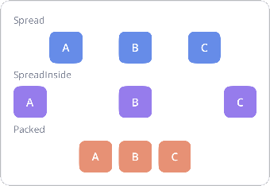
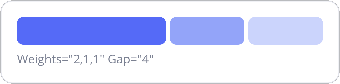
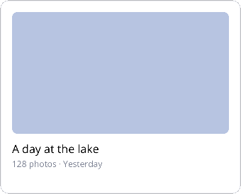
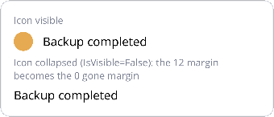
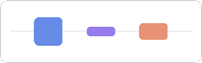
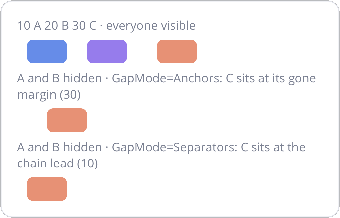

## Magnet by example

Twelve small, real-world layouts that build the Magnet mental model one concept at a time — the same way Android
developers learn ConstraintLayout. Every screenshot is rendered by the actual library (the gallery lives in the
TestApp: `Samples/Nalu.Maui.TestApp/Tests/MagnetExamplesPage.xaml`, page "Magnet Examples"); the snippets keep every
layout-relevant attribute and omit only colors and fonts.

The mental model in one paragraph: every view is positioned by anchoring its four poles (`Left/Top/Right/Bottom`) to
the poles of siblings, virtual nodes or the `parent`; a view anchored on **one** side of an axis sits there at its own
size, a view anchored on **both** sides floats between them (`HorizontalBias`/`VerticalBias`, default centered) or
fills the span (`WidthSizing="*"`). Everything else — barriers, guidelines, chains — is a virtual node you anchor to,
exactly like a view.

### 1 · List row — anchors, margins, alignment


The "hello world": an avatar pinned to the start, a title after it, a subtitle below the title, a time pinned to the
end. Note how the title spans between the avatar and the time (`After` + `Before`) with `HorizontalBias="0"` to
start-align it in that span.

```xml
<nalu:Magnet>
  <Border nalu:Magnet.MagnetId="avatar"
          nalu:Magnet.WidthSizing="48" nalu:Magnet.HeightSizing="48"
          nalu:Magnet.LeftTo="parent.Left" nalu:Magnet.TopTo="parent.Top" />
  <Label  nalu:Magnet.MagnetId="name" Text="Ada Lovelace"
          nalu:Magnet.After="avatar,12" nalu:Magnet.Before="time,8"
          nalu:Magnet.AlignTop="avatar" nalu:Magnet.HorizontalBias="0" />
  <Label  nalu:Magnet.MagnetId="message" Text="Working on the analytical engine…"
          nalu:Magnet.AlignLeft="name" nalu:Magnet.Below="name,2" />
  <Label  nalu:Magnet.MagnetId="time" Text="09:41"
          nalu:Magnet.RightTo="parent.Right" nalu:Magnet.AlignTop="name" />
</nalu:Magnet>
```

- `After="avatar,12"` is shorthand for `LeftTo="avatar.Right,12"`; `AlignTop="avatar"` for `TopTo="avatar.Top"`.
- This whole row is **one flat layout** — the Grid equivalent needs nested columns and rows.

### 2 · Login screen — FillWidth and horizontal centering


A vertical flow where fields fill the width and the logo/labels are centered. `FillWidth="parent"` anchors both sides
**and** sets `WidthSizing="*"`; `HorizontallyWithin="parent"` anchors both sides but keeps the measured width, so the
view floats centered.

```xml
<nalu:Magnet>
  <Border nalu:Magnet.MagnetId="logo"
          nalu:Magnet.WidthSizing="72" nalu:Magnet.HeightSizing="72"
          nalu:Magnet.HorizontallyWithin="parent" nalu:Magnet.TopTo="parent.Top,8" />
  <Label  nalu:Magnet.MagnetId="welcome" Text="Welcome back"
          nalu:Magnet.HorizontallyWithin="parent" nalu:Magnet.Below="logo,16" />
  <Entry  nalu:Magnet.MagnetId="email" Placeholder="Email"
          nalu:Magnet.FillWidth="parent" nalu:Magnet.Below="welcome,24" />
  <Entry  nalu:Magnet.MagnetId="password" Placeholder="Password"
          nalu:Magnet.FillWidth="parent" nalu:Magnet.Below="email,12" />
  <Button nalu:Magnet.MagnetId="signIn" Text="Sign in"
          nalu:Magnet.FillWidth="parent" nalu:Magnet.Below="password,20" />
  <Label  nalu:Magnet.MagnetId="forgot" Text="Forgot password?"
          nalu:Magnet.HorizontallyWithin="parent" nalu:Magnet.Below="signIn,14" />
</nalu:Magnet>
```

- `FillWidth` = both anchors + `*` sizing; `HorizontallyWithin` = both anchors + measured sizing (centered by bias).
- Each `Below` chains the vertical flow without any stack layout.

### 3 · Header bar — centering on the parent, not between siblings


The classic toolbar mistake is centering the title *between* the buttons: with asymmetric buttons the title drifts.
Anchoring the title to the **parent** keeps it optically centered regardless of what surrounds it.

```xml
<nalu:Magnet HeightRequest="48">
  <Button nalu:Magnet.MagnetId="back" Text="←"
          nalu:Magnet.WidthSizing="44" nalu:Magnet.HeightSizing="40"
          nalu:Magnet.LeftTo="parent.Left" nalu:Magnet.VerticallyWithin="parent" />
  <Label  nalu:Magnet.MagnetId="pageTitle" Text="Settings"
          nalu:Magnet.HorizontallyWithin="parent" nalu:Magnet.VerticallyWithin="parent" />
  <Button nalu:Magnet.MagnetId="menu" Text="⋯"
          nalu:Magnet.WidthSizing="44" nalu:Magnet.HeightSizing="40"
          nalu:Magnet.RightTo="parent.Right" nalu:Magnet.VerticallyWithin="parent" />
</nalu:Magnet>
```

- Views may overlap in a Magnet: the title's constraints are independent of the buttons'. If overlap must be avoided,
  anchor the title between the buttons instead — that is a *choice*, not a limitation.

### 4 · Form — a barrier aligns the fields after the longest label


Labels have different widths, but every field should start at the same x — after the *longest* label. That line is a
`MagnetBarrier`: a virtual vertical line at the outermost `Right` pole of its member nodes, which you anchor to like
any other node.

```xml
<nalu:Magnet>
  <nalu:Magnet.Definition>
    <nalu:MagnetDefinition>
      <nalu:MagnetBarrier MagnetId="labelsEnd" Direction="Right" Margin="12" Nodes="nameLabel,emailLabel" />
    </nalu:MagnetDefinition>
  </nalu:Magnet.Definition>
  <Label nalu:Magnet.MagnetId="nameLabel" Text="Name"
         nalu:Magnet.LeftTo="parent.Left" nalu:Magnet.VerticallyWithin="nameEntry" />
  <Label nalu:Magnet.MagnetId="emailLabel" Text="Email address"
         nalu:Magnet.LeftTo="parent.Left" nalu:Magnet.VerticallyWithin="emailEntry" />
  <Entry nalu:Magnet.MagnetId="nameEntry" nalu:Magnet.WidthSizing="*"
         nalu:Magnet.LeftTo="labelsEnd.Right" nalu:Magnet.RightTo="parent.Right"
         nalu:Magnet.TopTo="parent.Top" />
  <Entry nalu:Magnet.MagnetId="emailEntry" nalu:Magnet.WidthSizing="*"
         nalu:Magnet.LeftTo="labelsEnd.Right" nalu:Magnet.RightTo="parent.Right"
         nalu:Magnet.Below="nameEntry,8" />
</nalu:Magnet>
```

- The barrier moves when the labels change (localization!) and ignores collapsed members.
- X and Y are solved independently: the labels take their **y** from the entries (`VerticallyWithin`) while the
  entries take their **x** from the barrier — no cycle.

### 5 · Chain styles — distributing a group



A `MagnetChain` distributes a group of views along one axis. `Spread` puts equal gaps everywhere, `SpreadInside` pins
the first and last to the edges, `Packed` glues the group together (positioned by the head's bias).

```xml
<nalu:Magnet>
  <nalu:Magnet.Definition>
    <nalu:MagnetDefinition>
      <nalu:MagnetChain MagnetId="row" Style="Spread" Nodes="a,b,c" />
    </nalu:MagnetDefinition>
  </nalu:Magnet.Definition>
  <Button nalu:Magnet.MagnetId="a" Text="A" nalu:Magnet.TopTo="parent.Top" />
  <Button nalu:Magnet.MagnetId="b" Text="B" nalu:Magnet.TopTo="parent.Top" />
  <Button nalu:Magnet.MagnetId="c" Text="C" nalu:Magnet.TopTo="parent.Top" />
</nalu:Magnet>
```

- Members need **no** horizontal anchors: the chain runs from the first member's start anchor (default `parent.Left`)
  to the last member's end anchor (default `parent.Right`).
- In a `Packed` chain, anchors to the *adjacent* member (`After="a,8"`) add gaps inside the group.
- You rarely need a chain for a single centered view — chains are for distributing a *group* as a whole.

### 6 · Weighted columns — sharing space 2:1:1



Members sized `*` inside a chain share the remaining space according to `Weights` — the Magnet equivalent of Grid's
`2*,*,*` columns, but relocatable anywhere in the layout.

```xml
<nalu:Magnet>
  <nalu:Magnet.Definition>
    <nalu:MagnetDefinition>
      <nalu:MagnetChain MagnetId="bar" Nodes="w1,w2,w3" Weights="2,1,1" Gap="4" />
    </nalu:MagnetDefinition>
  </nalu:Magnet.Definition>
  <Border nalu:Magnet.MagnetId="w1" nalu:Magnet.WidthSizing="*" nalu:Magnet.HeightSizing="28" nalu:Magnet.TopTo="parent.Top" />
  <Border nalu:Magnet.MagnetId="w2" nalu:Magnet.WidthSizing="*" nalu:Magnet.HeightSizing="28" nalu:Magnet.TopTo="parent.Top" />
  <Border nalu:Magnet.MagnetId="w3" nalu:Magnet.WidthSizing="*" nalu:Magnet.HeightSizing="28" nalu:Magnet.TopTo="parent.Top" />
</nalu:Magnet>
```

- `Weights` is positional (aligned with `Nodes`); members without a weight default to 1.
- `Gap="4"` declares the uniform gap once on the chain, between consecutive visible members; collapsed members give
  their share (and their gap) back to the others. Per-pair `After="…,4"` anchors override it where declared.

### 7 · Media card — a 16:9 image via Ratio sizing



The hero image fills the width and derives its height from it: `HeightSizing = 0.5625 × width` (9/16). No measure
pass, no code-behind, and it adapts when the card resizes.

```xml
<nalu:Magnet HeightRequest="240">
  <Border nalu:Magnet.MagnetId="hero"
          nalu:Magnet.FillWidth="parent" nalu:Magnet.TopTo="parent.Top"
          nalu:Magnet.HeightSizing="{nalu:MagnetSizing 0.5625, Unit=Ratio}" />
  <Label  nalu:Magnet.MagnetId="cardTitle" Text="A day at the lake"
          nalu:Magnet.AlignLeft="hero" nalu:Magnet.Below="hero,10" />
  <Label  nalu:Magnet.MagnetId="cardMeta" Text="128 photos · Yesterday"
          nalu:Magnet.AlignLeft="hero" nalu:Magnet.Below="cardTitle,2" />
</nalu:Magnet>
```

- `Unit=Ratio` multiplies the **other axis** size: `0.5625` on the height means `height = width × 0.5625`.
- A Ratio driven by a `*` width wants a slot whose size is known (a filling slot, a fixed request like here, or a
  `Grid` star cell): in an auto-sized slot the measure pass hugs the *content* width, so the ratio would be computed
  against a narrower width than the one the parent finally assigns.

### 8 · Onboarding — a percent guideline splits the stage


A `MagnetGuideline` is a virtual line at `stageSize × Percent + Position`. Here the illustration takes the top 45%
regardless of the device height — the "proportional split" that otherwise needs a Grid with star rows.

```xml
<nalu:Magnet HeightRequest="300">
  <nalu:Magnet.Definition>
    <nalu:MagnetDefinition>
      <nalu:MagnetGuideline MagnetId="split" Orientation="Horizontal" Percent="0.45" />
    </nalu:MagnetDefinition>
  </nalu:Magnet.Definition>
  <Border nalu:Magnet.MagnetId="art"
          nalu:Magnet.FillWidth="parent" nalu:Magnet.HeightSizing="*"
          nalu:Magnet.TopTo="parent.Top" nalu:Magnet.BottomTo="split.Top,8" />
  <Label  nalu:Magnet.MagnetId="obTitle" Text="Stay organized"
          nalu:Magnet.HorizontallyWithin="parent" nalu:Magnet.TopTo="split.Bottom,16" />
  <Label  nalu:Magnet.MagnetId="obBody" Text="Your notes, synced on every device you own."
          nalu:Magnet.FillWidth="parent,24" nalu:Magnet.Below="obTitle,8" />
  <Button nalu:Magnet.MagnetId="obNext" Text="Continue"
          nalu:Magnet.FillWidth="parent" nalu:Magnet.BottomTo="parent.Bottom" />
</nalu:Magnet>
```

- `Percent` and `Position` are animatable values: moving a guideline relayouts without recompiling.
- The button is anchored to the bottom while the text flows from the guideline — two independent vertical flows in one
  layout.

### 9 · Visibility — collapsing a view and gone margins



`IsVisible="False"` collapses a view: its size becomes 0 and anchors targeting it switch to their **gone margin**
(the third value in `After="icon,12,0"`). The label glued 12dp after the icon snaps to the parent edge when the icon
disappears — no conditional layout code.

```xml
<nalu:Magnet>
  <Border nalu:Magnet.MagnetId="icon"
          nalu:Magnet.WidthSizing="24" nalu:Magnet.HeightSizing="24"
          nalu:Magnet.LeftTo="parent.Left" nalu:Magnet.TopTo="parent.Top" />
  <Label  nalu:Magnet.MagnetId="text" Text="Backup completed"
          nalu:Magnet.After="icon,12,0" nalu:Magnet.VerticallyWithin="icon" />
</nalu:Magnet>
```

- Anchor syntax: `"target,margin,gone:X"` (or the shortcut's third value) — the margin used when the target collapses.
- Toggling visibility never recompiles the layout; chains and barriers skip collapsed members automatically.

### 10 · Packed chain + measured member — the FlexLayout replacement


A name with a badge glued to its right: with a short name the badge sits right after it; when the name grows it
ellipsizes and the badge stays visible at the edge. Elsewhere this needs a `FlexLayout`; here it is a packed chain
whose measured member shrinks to leave room for its siblings.

```xml
<nalu:Magnet>
  <nalu:Magnet.Definition>
    <nalu:MagnetDefinition>
      <nalu:MagnetChain MagnetId="row" Style="Packed" Nodes="name,badge" />
    </nalu:MagnetDefinition>
  </nalu:Magnet.Definition>
  <Label  nalu:Magnet.MagnetId="name" Text="Ada" LineBreakMode="TailTruncation"
          nalu:Magnet.LeftTo="parent.Left" nalu:Magnet.TopTo="parent.Top" nalu:Magnet.HorizontalBias="0" />
  <Border nalu:Magnet.MagnetId="badge"
          nalu:Magnet.WidthSizing="16" nalu:Magnet.HeightSizing="16"
          nalu:Magnet.After="name,6" nalu:Magnet.RightTo="parent.Right"
          nalu:Magnet.VerticallyWithin="name" />
</nalu:Magnet>
```

- The name keeps its default `Measured` sizing: in a chain, a measured member is measured with the room left by the
  other members, so it wraps/truncates exactly when it must.
- `HorizontalBias="0"` on the head packs the group to the start.

### 11 · Vertical centering in a horizontal chain — the guideline idiom



A horizontal chain owns only the X axis: each member's Y is free. To center members of different heights on each
other, give them all `VerticallyWithin` the same reference. The most flexible reference is a horizontal
**guideline**: it spans a zero-height segment, so the default bias 0.5 puts every member's **center exactly on the
line** (the thin line in the screenshot is a real 1dp view, itself centered on the guideline).

```xml
<nalu:Magnet HeightRequest="72">
  <nalu:Magnet.Definition>
    <nalu:MagnetDefinition>
      <nalu:MagnetGuideline MagnetId="midline" Orientation="Horizontal" Percent="0.5" />
      <nalu:MagnetChain MagnetId="row" Style="Spread" Nodes="tall,short,mid" />
    </nalu:MagnetDefinition>
  </nalu:Magnet.Definition>
  <Border nalu:Magnet.MagnetId="tall"  nalu:Magnet.WidthSizing="48" nalu:Magnet.HeightSizing="48"
          nalu:Magnet.VerticallyWithin="midline" />
  <Border nalu:Magnet.MagnetId="short" nalu:Magnet.WidthSizing="48" nalu:Magnet.HeightSizing="16"
          nalu:Magnet.VerticallyWithin="midline" />
  <Border nalu:Magnet.MagnetId="mid"   nalu:Magnet.WidthSizing="48" nalu:Magnet.HeightSizing="28"
          nalu:Magnet.VerticallyWithin="midline" />
</nalu:Magnet>
```

- The two simpler variants of the same idiom: `VerticallyWithin="parent"` centers each member in the row, and
  `VerticallyWithin="tall"` centers the others on a reference member (works even when the reference is *shorter* —
  negative slack still centers).
- There is no CenterY pole — like ConstraintLayout, centering is "both anchors + bias 0.5", and the zero-height
  guideline turns that into an exact center line.

### 12 · Chain margins under collapse — Anchors vs Separators



The same `10 A 20 B 30 C` packed chain, three times: everyone visible, then A and B hidden with the two
`GapMode`s. `Anchors` (the default) follows the ConstraintLayout rules — the collapsed members drop their own
margins and C lands at its gone margin (30). `Separators` treats margins as structure — the leading 10 belongs to
the **chain** and survives, so the first visible member sits at the chain lead, whichever member it is.

```xml
<nalu:MagnetChain MagnetId="row" Style="Packed" GapMode="Separators" Nodes="a,b,c" />
<!-- a: LeftTo="parent.Left,10" · b: After="a,20" · c: After="b,30" -->
```

- In `Separators` mode the inner margins apply only between visible members (gone margins are not involved), and
  the last member's end margin survives the tail collapsing too.
- For a uniform gap, skip the per-pair anchors entirely: `Gap="8"` on the chain has separator semantics in both
  modes and is animatable.
- This is the StackLayout padding+spacing model, per pair — a semantics ConstraintLayout cannot express statically.

### Regenerating the screenshots

The gallery page is driven by a DevFlow UI test: launch the TestApp on the iOS simulator, then

```bash
DOCS_SHOTS_DIR=$(pwd)/conceptual_docs/assets/images/magnet dotnet test UITests/UITests.DevFlow -- --filter-class Nalu.Maui.UITests.Tests.MagnetExamplesShotsTests
```
