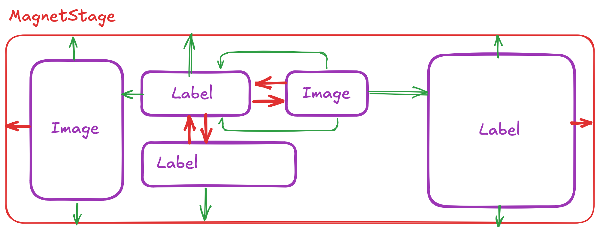

## Magnet

`Magnet` is a **constraint-based** layout: every child is positioned by anchoring its sides to other children,
to virtual nodes (barriers, guidelines, chains) or to the `parent` stage — the same mental model as Android's
`ConstraintLayout`, without nesting.



Magnet 2.0 is a full rewrite: the constraint graph is **compiled** into a small instruction tape that is executed
on every measure/arrange with zero allocations. Measure+arrange cost is now on par with `Grid`, with a fraction of the
allocations; see [Performance](#performance).

> Coming from Magnet 1.x? Read the [migration guide](layouts-magnet-migration.md): the API changed.

### Quick start

```xml
xmlns:nalu="https://nalu-development.github.com/nalu/layouts"

<nalu:Magnet>
  <nalu:Magnet.Definition>
    <nalu:MagnetDefinition>
      <nalu:MagnetBarrier MagnetId="textsEnd" Direction="Bottom" Margin="8">
        <x:String>avatar</x:String>
        <x:String>subtitle</x:String>
      </nalu:MagnetBarrier>
    </nalu:MagnetDefinition>
  </nalu:Magnet.Definition>

  <Image  nalu:Magnet.MagnetId="avatar"
          nalu:Magnet.WidthSizing="48" nalu:Magnet.HeightSizing="48"
          nalu:Magnet.LeftTo="parent.Left,16" nalu:Magnet.TopTo="parent.Top,16" />
  <Label  nalu:Magnet.MagnetId="title"
          nalu:Magnet.After="avatar,12,0" nalu:Magnet.RightTo="parent.Right,16"
          nalu:Magnet.AlignTop="avatar" nalu:Magnet.HorizontalBias="0" />
  <Label  nalu:Magnet.MagnetId="subtitle"
          nalu:Magnet.AlignLeft="title" nalu:Magnet.Below="title,2" />
  <Button nalu:Magnet.MagnetId="cta"
          nalu:Magnet.FillWidth="parent,16" nalu:Magnet.Below="textsEnd" />
</nalu:Magnet>
```

The same in C# (fluent, targets can be ids, views or nodes):

```csharp
var magnet = new Magnet();
Magnet.GetConstraints(avatar).Id("avatar").Size(48, 48).AlignLeft("parent", 16).AlignTop("parent", 16);
Magnet.GetConstraints(title).Id("title").After(avatar, 12, goneMargin: 0).Right("parent", margin: 16).AlignTop(avatar);
Magnet.GetConstraints(cta).Id("cta").FillWidth("parent", 16).Below("textsEnd");
magnet.Add(avatar);
magnet.Add(title);
magnet.Add(cta);
```

### Concepts

#### Nodes and identifiers

Everything Magnet positions is a **node** with a mandatory, unique `MagnetId`:

| Node | Purpose |
|---|---|
| `MagnetView` | the constraints of a child view (anchors, size, bias) |
| `MagnetBarrier` | a line at the outermost `Direction` pole of a set of nodes |
| `MagnetGuideline` | a line at a percent/absolute position of the stage |
| `MagnetChain` | lays a group of views out along one axis (spread / spread-inside / packed, weights) |

Nodes live in a `MagnetDefinition`. `MagnetView`s are usually created **inline** through the attached properties
(`Magnet.MagnetId`, `Magnet.LeftTo`, …) or `Magnet.GetConstraints(view)`; virtual nodes are declared in
`Magnet.Definition`. A `MagnetView` declared in the definition is bound to the child whose `Magnet.MagnetId` matches
(the child then carries **only** the id — a duplicate inline node is an error). If you don't assign a definition,
the layout creates one.

`MagnetId` is the only identity: nothing falls back to `AutomationId`. By default the id is copied **to**
`AutomationId` when the latter is not set (`Magnet.PropagateMagnetIdToAutomationId="False"` disables it) — handy for
UI tests.

> A `MagnetDefinition` is stateful and belongs to exactly one `Magnet`: never share one instance across layouts
> (do not declare it as an app-wide `StaticResource`); inline inside a `DataTemplate` is fine, each inflation creates
> a fresh instance.

#### Anchors

`LeftTo` / `RightTo` / `TopTo` / `BottomTo` are `MagnetAnchor`s: `target.Pole[,margin[,gone:goneMargin]]`, e.g.
`parent.Left`, `avatar.Right,12`, `avatar.Right,12,gone:0`. Horizontal sides can only reference `Left`/`Right`
poles, vertical sides `Top`/`Bottom`. Barriers and guidelines have a single pole per axis (`textsEnd.Bottom`,
`mid.Left`), chains cannot be targeted (anchor to their first/last member).

The **relative shortcuts** say the same thing with a verb; their value is a `MagnetTarget`: `target[,margin[,goneMargin]]`
(`"avatar"`, `"avatar,12"`, `"avatar,12,0"`, `"avatar,12,gone:0"`):

| Shortcut | Equivalent |
|---|---|
| `After="a,12"` / `Before="a,12"` | `LeftTo="a.Right,12"` / `RightTo="a.Left,12"` |
| `Below="a,12"` / `Above="a,12"` | `TopTo="a.Bottom,12"` / `BottomTo="a.Top,12"` |
| `AlignLeft` / `AlignRight` / `AlignTop` / `AlignBottom="a"` | `LeftTo="a.Left"` / `RightTo="a.Right"` / `TopTo="a.Top"` / `BottomTo="a.Bottom"` |
| `HorizontallyWithin` / `VerticallyWithin` / `Within="a"` | both anchors of the axis (axes) to `a` — the view is placed by the bias (0.5 = centered) |
| `FillWidth` / `FillHeight="a,16"` | both anchors of the axis to `a` + `WidthSizing`/`HeightSizing="*"` |

**All the constraint attached properties are set-only commands** (`LeftTo`…, `WidthSizing`/`HeightSizing`, the biases and
the shortcuts): setting one writes into the child's `MagnetView` node (`Magnet.GetConstraints(view)`, the only place to
*read* constraints — the static getters are hidden and fail to compile). Several of them may write the same side
(`After` and `AlignLeft` both write `LeftTo`): the last one set wins. Clearing one (`{x:Null}`, `ClearValue`) removes the
constraint it wrote only if nobody overwrote it in the meantime. `MagnetId` is the exception: it is a real, readable
attached property.

- one anchor per axis: the view sticks to it;
- two anchors: the view is placed inside the span using `HorizontalBias` / `VerticalBias` (0..1, default 0.5);
- no anchor: the view sits at the stage origin.

`GoneMargin` is used instead of `Margin` when the **target** view is collapsed; a collapsed view drops its own
margins.

#### Sizes

`Magnet.WidthSizing` / `Magnet.HeightSizing` (attached) and `MagnetView.WidthSizing` / `HeightSizing` are `MagnetSizing`s. Three
common cases have a string form; everything else uses the `{nalu:MagnetSizing}` markup extension (`Value` is the content):

| XAML | Unit | Meaning |
|---|---|---|
| *(unset)* | `Measured` | the view's desired size (default) |
| `"48"` | `Fixed` | fixed dp |
| `"*"` | `Constraint` | fills the span between the two anchors (weighted share inside a chain) |
| `"50%"` | `ConstraintPercent` | a fraction of the span between the two anchors |
| `{nalu:MagnetSizing 0.5, Unit=StagePercent}` | `StagePercent` | a fraction of the stage size, regardless of the anchors (`1` = as wide as the layout) |
| `{nalu:MagnetSizing 1.5, Unit=Ratio}` | `Ratio` | 1.5 × the other axis |
| `{nalu:MagnetSizing 1.5, Unit=Measured}` | `Measured` (scaled) | 1.5 × the view's desired size |
| `{nalu:MagnetSizing Unit=Constraint, Max=320}` | any + bounds | `Min`/`Max` clamp any unit; `Max` is also the measure constraint of a `Measured` view (a `Label` wraps at it) |

In C#: `MagnetSizing.Fixed(48)`, `MagnetSizing.Constraint`, `MagnetSizing.Percent(0.5)`, `MagnetSizing.StagePercent(0.5)`,
`MagnetSizing.Ratio(1.5)`, `MagnetSizing.Scaled(1.5)`, `.WithBounds(min, max)`, plus implicit conversions from `double`
(fixed) and from the three string forms.

A `Ratio` height works with any width; a `Ratio` width fed by a height that depends on the vertical layout (`*`, percent —
e.g. a thumbnail as tall as its row) triggers one bounded cross-axis feedback pass (ConstraintLayout semantics): the X
pass uses the height from the previous execution, and X+Y are re-run once when the Y pass changed it. Layouts without
such a node pay nothing for this.

#### Visibility (GONE)

There is no visibility on nodes: `IsVisible="False"` on the view collapses it — its size becomes 0, anchors to it use
the gone margin, chains and barriers skip it. Toggling visibility never recompiles the layout.

#### Chains

Chains are **explicit** nodes (unlike Android, which infers them from mutual anchors):

```xml
<nalu:MagnetChain MagnetId="row" Orientation="Horizontal" Style="Spread">
  <x:String>a</x:String><x:String>b</x:String><x:String>c</x:String>
</nalu:MagnetChain>
```

The chain start is the first member's `LeftTo` (default `parent.Left`), the end is the last member's `RightTo`
(default `parent.Right`). Inner members must not carry anchors on the chain axis, except anchors to the adjacent
member (which only contribute their margin, e.g. `b.LeftTo="a.Right,8"`). `Packed` uses the first member's bias
(`HorizontalBias="0.3"` on the head puts the packed group at 30% of the free space). Members sized `*` share the
remaining space according to `Weights` (positional, aligned with `Nodes`, default 1). `Measured` members are measured with the room left by
the other members (in chain order): a packed `[name, star]` chain lets the name grow until it must ellipsize while the
star stays glued to its right — the pattern that needs a `FlexLayout` elsewhere.

You do not need a chain for "one view fixed, the other centered in the rest": two anchors and a bias do that
(`b.LeftTo="a.Right" b.RightTo="parent.Right"`). A chain is for a *group* distributed as a whole.

#### Hug vs fill

Measure returns the **content extent** (every view fits between the stage edges), clamped by the constraint; the
assigned size is used at arrange time. A `*`-sized child contributes only its margins (and `min`) to the hug — put
the `Magnet` in a filling slot when you want fill semantics.

#### Barriers and guidelines

```xml
<nalu:MagnetBarrier MagnetId="textsEnd" Direction="Right" Margin="8"><x:String>title</x:String>…</nalu:MagnetBarrier>   <!-- content = Nodes -->
<nalu:MagnetGuideline MagnetId="mid" Orientation="Vertical" Percent="0.5" Position="0" />
```

A guideline is placed at `stageSize × Percent + Position` (both animatable). `Percent`-based guidelines are taken
into account exactly when hugging.

### Fluent API (C#)

`Magnet.GetConstraints(view)` returns the view's `MagnetView` node (created on first access, registered when the view is
added to the layout); every setter returns the node. Besides the primitives (`Left/Right/Top/Bottom(target, pole, margin,
goneMargin)`, `Size`, `Bias`, `Id`) the node offers the same **relative shortcuts** available in XAML:

```csharp
Magnet.GetConstraints(avatar).Id("avatar").Size(48, 48).AlignLeft("parent", 16).AlignTop("parent", 16);
Magnet.GetConstraints(title).Id("title")
      .After(avatar, 12, goneMargin: 0)      // LeftTo = avatar.Right (target = view, node or id)
      .Right("parent", margin: 16)
      .AlignTop(avatar);
Magnet.GetConstraints(subtitle).Id("subtitle").AlignLeft(title).Below(title, 2);
Magnet.GetConstraints(cta).Id("cta").FillWidth("parent", 16).Below("textsEnd");   // both anchors + WidthSizing "*"
Magnet.GetConstraints(badge).Id("badge").Within(avatar);

magnet.Definition = new MagnetDefinition().Add(
    new MagnetBarrier { MagnetId = "textsEnd", Direction = MagnetPole.Bottom, Margin = 8 }.With(avatar, subtitle),
    new MagnetChain { MagnetId = "row", Style = MagnetChainStyle.Packed }.With("name", "star"),
    new MagnetGuideline { MagnetId = "mid", Percent = 0.5 });
```

| Shortcut | Equivalent |
|---|---|
| `After(t)` / `Before(t)` | `Left(t, Right)` / `Right(t, Left)` |
| `Below(t)` / `Above(t)` | `Top(t, Bottom)` / `Bottom(t, Top)` |
| `AlignLeft/Right/Top/Bottom(t)` | same-side anchor |
| `HorizontallyWithin/VerticallyWithin/Within(t)` | both anchors of the axis (axes) — centered by the bias |
| `FillWidth/FillHeight(t)` | both anchors + `WidthSizing`/`HeightSizing = "*"` |

Every target accepts an id string, a `MagnetTarget` (`"avatar,12,gone:0"`), a **view** carrying `Magnet.MagnetId` (or an
inline node with `Id(...)`) or a **node**; `MagnetChain.With(...)` / `MagnetBarrier.With(...)` accept views too.
Shortcuts and primitives write the same node property: the last one wins. `MagnetSizing.Fixed/Constraint/Percent/
StagePercent/Ratio/Scaled` and implicit conversions from `double` (fixed) and from the three string forms. The attached
setters (`Magnet.SetAfter(view, "avatar,12")`) write into the same node.

### Changing constraints at runtime

Every node property is bindable. Changes are classified: **values** (margins, biases, sizes, percents, weights)
patch the compiled tape; **structure** (targets, poles, units, nodes added/removed) recompiles it. Both coalesce
into a single `InvalidateMeasure`.

Compile errors (unknown target, axis mismatch, cycles, zero chain weights, …) surface as
`InvalidOperationException` from the first measure after the offending change; every message names the
`MagnetId`s and properties involved.

### Transitions

```csharp
await magnet.TransitionToAsync(() =>
{
    Magnet.GetConstraints(avatar).Left("parent", margin: 80).Top("parent", margin: 80);
    details.IsVisible = true;
}, length: 300, easing: Easing.CubicInOut);
```

`TransitionToAsync(Action mutate)` applies the mutation and animates from the current state to the new one:

- **value-only** changes interpolate the constraint *inputs*, so intermediate frames obey the constraints exactly
  (animating a guideline `Percent` or a chain weight moves every dependent view correctly);
- structural changes and visibility toggles interpolate frames; appearing views fade in (a view hidden with
  `IsVisible=false` disappears immediately: the platform hides it before the animation can run);
- a new transition retargets from the current interpolated state (the previous task completes with `false`);
- when the layout's own size changes the ancestors reflow every tick (inherently more expensive).

`TransitionToAsync(MagnetDefinition end)` swaps the whole definition, matching nodes by `MagnetId`.

### Performance

Benchmarks (`Tests/Nalu.Maui.Benchmarks`, Apple M-series). Two scenarios, both with the same leaf views for Grid and
Magnet; 1000 × measure+arrange per row, inflation = 100 instances including compile and first layout.

**Row**: 5 views in one row, the middle one filling the remaining space (Grid `Auto,Auto,*,Auto,Auto` vs a horizontal
`MagnetChain` with a `*` member).

| Method | Grid | Magnet 2 |
|---|---:|---:|
| Child invalidated every pass (e.g. text change) | 0.91 ms / 1.52 MB | 1.20 ms / **0.37 MB** |
| Nothing changed (MAUI re-measures often) | 0.89 ms / 1.46 MB | 1.17 ms / **0.31 MB** |
| Changing bounds (rotation) | 1.18 ms / 1.78 MB | 1.49 ms / **0.61 MB** |
| Value patch (animated margin) + relayout | – | 2.22 ms / 0.72 MB |
| Inflation | 4.2 ms / 8.0 MB | 5.1 ms / 9.2 MB |

**Card** (the sample-app credit card: image | name + star / detail | money): the Grid version needs three nested layouts
(`Grid` + `VerticalStackLayout` + `FlexLayout`), the Magnet version is flat (a packed name+star chain).

| Method | Grid (3 layouts) | Magnet 2 (flat) |
|---|---:|---:|
| Child invalidated every pass | 0.61 ms / 1.12 MB | 0.71 ms / **0.37 MB** |
| Nothing changed | 0.59 ms / 1.07 MB | 0.67 ms / **0.31 MB** |
| Inflation | 2.9 ms / 4.9 MB | 2.95 ms / 5.3 MB |

> **These benchmarks measure only the managed layout algorithm** (no handlers, no platform views). They ignore what
> nested layouts cost in a real app: every extra layout is an extra native view (`UIView` / `ViewGroup` / `Panel`) to
> create and map, one more native→managed round trip (JNI/Objective-C) per measure and arrange pass, one more level for
> native traversals (window insets, hit-testing, accessibility), one more layer to render and more native memory. A flat
> `Magnet` replaces that whole nesting with a single native view: the ~0.2 µs of algorithmic overhead per relayout is
> noise next to a single native measure call, and the saved hierarchy is what actually shows up in list scrolling.

#### On device (TestApp "Magnet Perf" page)

The TestApp ships a manual benchmark page (`Magnet Perf`) that inflates N cards of both flavours and hooks
`SizeChanged` on every element of every card: "settled" is the last size change of the whole subtree, i.e. the real end
of the native layout pass. Debug builds (JIT, no AOT), 200 cards, warm second run — absolute numbers are inflated by the
Debug configuration, the ratio is what matters:

| 200 cards | iPhone 17 Pro simulator | Android emulator (arm64) |
|---|---|---|
| Inflate: `Add` (handlers + native views) → settled | Grid 1592 ms · **Magnet 1228 ms** (−23%) | Grid 8272 ms · **Magnet 7978 ms** (layout phase after `Add`: 1351 vs 954 ms, −29%) |
| Text change on every card → settled | Grid 270 ms · **Magnet 209 ms** (−23%) | Grid 757 ms · **Magnet 560 ms** (−26%) |
| `SizeChanged` events per inflate | Grid 1800 · Magnet 1267 | Grid 1800 · Magnet 1267 |

On device the flat Magnet wins on every scenario, by the cost of the two native views per card that the nested Grid
needs. `Magnet VirtualScroll Perf` (2000 cards in a `VirtualScroll`, definition declared inline in the template) shows
the recycled-cell case: a handful of inflations, one compilation shared by every cell.

Takeaways (managed only): a full relayout costs 1.1–1.3× a `Grid` with 3–4× fewer allocations (the generic tape
interpreter does more work than three trivial specialized layouts, see the on-device numbers for the other side of the
coin); an arrange that follows a measure with matching bounds re-uses the child measures, an arrange without a measure
in between (recycled cells) re-measures; the remaining allocations come from MAUI's own `Measure`/`Arrange` plumbing
(the engine allocates only when compiling).
Compiled tapes are pure and shared through a small LRU cache keyed by the structure of the definition, so
template-instantiated cells compile once; inflating a card costs about the same as its nested-Grid equivalent.

### When to use Magnet

**Good use cases:** complex layouts that would need nested `Grid`/`StackLayout`s, elements positioned relative to
several others, responsive layouts adapting to content size, layout-driven animations.

**Consider alternatives** for trivial layouts a `Grid` or `StackLayout` expresses directly.
