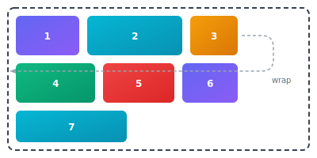
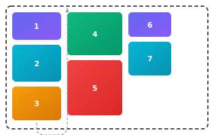
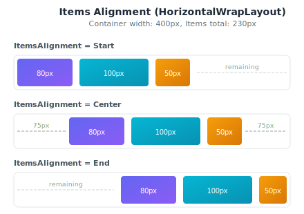
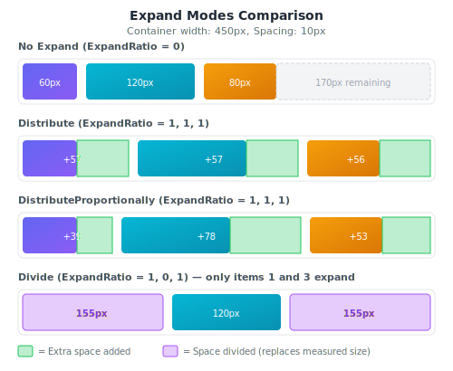

## Wrap Layouts

Wrap layouts arrange children in sequential positions, automatically wrapping to the next row or column when the available space is exceeded. They are perfect for creating tag clouds, chip groups, or any flowing content.

### Overview

Nalu provides two wrap layout variants:

- **`HorizontalWrapLayout`** - Arranges items left-to-right, wrapping to new rows
- **`VerticalWrapLayout`** - Arranges items top-to-bottom, wrapping to new columns

Both layouts inherit from `WrapLayout` and share the same properties and expand modes.

### HorizontalWrapLayout

Arranges children horizontally from left to right, wrapping to the next row when the available width is exceeded.



```xml
<nalu:HorizontalWrapLayout HorizontalSpacing="10" VerticalSpacing="10">
    <Label Text="1" BackgroundColor="#6366f1" TextColor="White" Padding="16,8" />
    <Label Text="2" BackgroundColor="#06b6d4" TextColor="White" Padding="16,8" />
    <Label Text="3" BackgroundColor="#f59e0b" TextColor="White" Padding="16,8" />
    <Label Text="4" BackgroundColor="#10b981" TextColor="White" Padding="16,8" />
    <Label Text="5" BackgroundColor="#ef4444" TextColor="White" Padding="16,8" />
    <Label Text="6" BackgroundColor="#6366f1" TextColor="White" Padding="16,8" />
    <Label Text="7" BackgroundColor="#06b6d4" TextColor="White" Padding="16,8" />
</nalu:HorizontalWrapLayout>
```

### VerticalWrapLayout

Arranges children vertically from top to bottom, wrapping to the next column when the available height is exceeded.



```xml
<nalu:VerticalWrapLayout HorizontalSpacing="10" VerticalSpacing="8" HeightRequest="200">
    <Label Text="1" BackgroundColor="#6366f1" TextColor="White" Padding="16,8" />
    <Label Text="2" BackgroundColor="#06b6d4" TextColor="White" Padding="16,8" />
    <Label Text="3" BackgroundColor="#f59e0b" TextColor="White" Padding="16,8" />
    <Label Text="4" BackgroundColor="#10b981" TextColor="White" Padding="16,8" />
    <Label Text="5" BackgroundColor="#ef4444" TextColor="White" Padding="16,8" />
    <Label Text="6" BackgroundColor="#6366f1" TextColor="White" Padding="16,8" />
    <Label Text="7" BackgroundColor="#06b6d4" TextColor="White" Padding="16,8" />
</nalu:VerticalWrapLayout>
```

> **Note:** `VerticalWrapLayout` requires a constrained height (e.g., `HeightRequest` or parent constraint) to determine when to wrap to the next column.

### Properties

| Property | Type | Default | Description |
|----------|------|---------|-------------|
| `HorizontalSpacing` | `double` | `0` | The horizontal space between items |
| `VerticalSpacing` | `double` | `0` | The vertical space between rows/columns |
| `ExpandMode` | `WrapLayoutExpandMode` | `Distribute` | How remaining space is distributed among expanding items |
| `ItemsAlignment` | `WrapLayoutItemsAlignment` | `Start` | How items are aligned within each row/column when there's remaining space |

### Items Alignment

The `ItemsAlignment` property controls how items are positioned within each row (for `HorizontalWrapLayout`) or column (for `VerticalWrapLayout`) when there is remaining space and no items are expanding.



```xml
<!-- Items aligned to the end (right) -->
<nalu:HorizontalWrapLayout ItemsAlignment="End" HorizontalSpacing="10">
    <Label Text="80px" BackgroundColor="#6366f1" Padding="8,4" TextColor="White" />
    <Label Text="100px" BackgroundColor="#06b6d4" Padding="8,4" TextColor="White" />
    <Label Text="50px" BackgroundColor="#f59e0b" Padding="8,4" TextColor="White" />
</nalu:HorizontalWrapLayout>

<!-- Items centered -->
<nalu:HorizontalWrapLayout ItemsAlignment="Center" HorizontalSpacing="10">
    <Label Text="80px" BackgroundColor="#6366f1" Padding="8,4" TextColor="White" />
    <Label Text="100px" BackgroundColor="#06b6d4" Padding="8,4" TextColor="White" />
    <Label Text="50px" BackgroundColor="#f59e0b" Padding="8,4" TextColor="White" />
</nalu:HorizontalWrapLayout>
```

| Value | Description |
|-------|-------------|
| `Start` | Items are aligned to the start (left for horizontal, top for vertical) |
| `Center` | Items are centered within the available space |
| `End` | Items are aligned to the end (right for horizontal, bottom for vertical) |

> **Note:** `ItemsAlignment` only takes effect when there is remaining space in the row/column and no items have an `ExpandRatio > 0`. When items expand, they consume the remaining space, leaving no room for alignment adjustments.

### Expand System

The wrap layouts support a flexible expand system that allows items to fill remaining space in their row or column. This is controlled by the `ExpandRatio` attached property and the `ExpandMode` property.

#### ExpandRatio Attached Property

Set on individual children to indicate they should receive extra space:

```xml
<nalu:HorizontalWrapLayout HorizontalSpacing="8" VerticalSpacing="8">
    <!-- This item will expand to fill remaining space -->
    <Label Text="Expand Me" 
           nalu:WrapLayout.ExpandRatio="1" 
           BackgroundColor="LightBlue" Padding="8,4" />
    
    <!-- This item keeps its natural size -->
    <Label Text="Fixed" BackgroundColor="LightGreen" Padding="8,4" />
</nalu:HorizontalWrapLayout>
```

- `ExpandRatio="0"` (default) - Item keeps its natural size
- `ExpandRatio="1"` - Item participates in expansion
- `ExpandRatio="2"` - Item receives twice the extra space compared to items with ratio 1

### Expand Modes

The `ExpandMode` property determines how the remaining space is distributed among items with `ExpandRatio > 0`.



#### Distribute (Default)

Adds the remaining space equally among all expanding items based on their expand ratio.

```xml
<nalu:HorizontalWrapLayout ExpandMode="Distribute" HorizontalSpacing="8">
    <Label Text="A" nalu:WrapLayout.ExpandRatio="1" WidthRequest="60" />
    <Label Text="B" nalu:WrapLayout.ExpandRatio="1" WidthRequest="120" />
    <Label Text="C" nalu:WrapLayout.ExpandRatio="1" WidthRequest="80" />
</nalu:HorizontalWrapLayout>
```

If 160px remains and all items have `ExpandRatio="1"`:
- Each item receives: `160 / 3 ≈ 53px` extra

#### DistributeProportionally

Distributes remaining space proportionally to each item's current size multiplied by its expand ratio.

```xml
<nalu:HorizontalWrapLayout ExpandMode="DistributeProportionally" HorizontalSpacing="8">
    <Label Text="Small" nalu:WrapLayout.ExpandRatio="1" WidthRequest="60" />
    <Label Text="Large" nalu:WrapLayout.ExpandRatio="1" WidthRequest="120" />
</nalu:HorizontalWrapLayout>
```

If 90px remains:
- Small (60px): receives `60 / (60+120) × 90 = 30px` extra → **90px total**
- Large (120px): receives `120 / (60+120) × 90 = 60px` extra → **180px total**

#### Divide

After measuring non-expanding items, divides the remaining space equally among expanding items (weighted by expand ratio). The key difference from `Distribute` is that `Divide` mode replaces the item's measured size rather than adding to it.

**Important behaviors:**

- **Wrapping is based on measured size**: Items are still placed in rows/columns based on their measured (desired) size. If an item's measured size exceeds the available space in the current row, it will wrap to the next row.
- **Items never shrink below their measured size**: When dividing the remaining space, if an item's calculated share is less than its measured size, it keeps its measured size. The remaining space is then redistributed among other expanding items that can still grow.

This makes `Divide` ideal for scenarios like form layouts where you want equal-width fields, but you also want items to wrap gracefully when the container is too narrow.

### Practical Examples

#### Tag Cloud

```xml
<nalu:HorizontalWrapLayout HorizontalSpacing="8" VerticalSpacing="8" Padding="16">
    <Border StrokeShape="RoundRectangle 12" BackgroundColor="#E3F2FD" Padding="12,6">
        <Label Text="C#" TextColor="#1565C0" />
    </Border>
    <Border StrokeShape="RoundRectangle 12" BackgroundColor="#E8F5E9" Padding="12,6">
        <Label Text=".NET MAUI" TextColor="#2E7D32" />
    </Border>
    <Border StrokeShape="RoundRectangle 12" BackgroundColor="#FFF3E0" Padding="12,6">
        <Label Text="Xamarin" TextColor="#E65100" />
    </Border>
    <Border StrokeShape="RoundRectangle 12" BackgroundColor="#FCE4EC" Padding="12,6">
        <Label Text="Mobile" TextColor="#C2185B" />
    </Border>
</nalu:HorizontalWrapLayout>
```

#### Action Buttons Row

```xml
<nalu:HorizontalWrapLayout HorizontalSpacing="8" VerticalSpacing="8">
    <Button Text="Cancel" BackgroundColor="LightGray" />
    <Button Text="Save" nalu:WrapLayout.ExpandRatio="1" BackgroundColor="CornflowerBlue" />
</nalu:HorizontalWrapLayout>
```

#### Vertical Menu with Height Constraint

```xml
<nalu:VerticalWrapLayout HeightRequest="300" HorizontalSpacing="16" VerticalSpacing="4">
    <Button Text="Home" />
    <Button Text="Profile" />
    <Button Text="Settings" />
    <Button Text="Help" />
    <Button Text="About" />
    <Button Text="Logout" />
</nalu:VerticalWrapLayout>
```

#### Dynamic Chips with BindableLayout

```xml
<nalu:HorizontalWrapLayout HorizontalSpacing="6" 
                            VerticalSpacing="6"
                            BindableLayout.ItemsSource="{Binding Tags}">
    <BindableLayout.ItemTemplate>
        <DataTemplate x:DataType="models:Tag">
            <Border StrokeShape="RoundRectangle 16" 
                    BackgroundColor="{Binding Color}" 
                    Padding="12,6">
                <HorizontalStackLayout Spacing="4">
                    <Label Text="{Binding Name}" VerticalOptions="Center" />
                    <ImageButton Source="close.png" 
                                 WidthRequest="16" 
                                 HeightRequest="16"
                                 Command="{Binding RemoveCommand}" />
                </HorizontalStackLayout>
            </Border>
        </DataTemplate>
    </BindableLayout.ItemTemplate>
</nalu:HorizontalWrapLayout>
```

### Performance/DevEx Considerations

If your goal is to create a single line of views where some of them expand, usually you would leverage `Grid` + `*`.

However, there's an important behavioral difference: **Grid constrains items to the row**, so `*` columns will shrink items if space is limited. In contrast, **WrapLayout respects item measured sizes** and wraps items to the next line instead of shrinking them.

Additionally, `HorizontalWrapLayout` + `ExpandMode` offers not only a simpler/faster definition,

**Grid (`Auto` + `*`)**

```xml
<Grid ColumnSpacing="8"
      ColumnDefinitions="*,Auto">
    <Entry Grid.Column="0"
           Placeholder="Search..." />
    <Button Grid.Column="1"
            Text="Search" />
</Grid>
```

**HorizontalWrapLayout**

```xml
<nalu:HorizontalWrapLayout HorizontalSpacing="8">
    <Entry Placeholder="Search..."
           nalu:WrapLayout.ExpandRatio="1" />
    <Button Text="Search" />
</nalu:HorizontalWrapLayout>
```

but it's also way faster (see our `BenchmarkDotNet` results).


| Method                        | Mean     | Error     | StdDev    | Gen0     | Gen1   | Allocated |
|------------------------------ |---------:|----------:|----------:|---------:|-------:|----------:|
| Grid (constant size items)    | 2.762 ms | 0.0229 ms | 0.0203 ms | 410.1563 | 3.9063 |   3.28 MB |
| Wrap (constant size items)    | 1.588 ms | 0.0218 ms | 0.0204 ms | 316.4063 |      - |   2.55 MB |
| Grid (dynamic size items)     | 5.138 ms | 0.0858 ms | 0.0760 ms | 585.9375 | 7.8125 |   4.74 MB |
| Wrap (dynamic size items)     | 1.823 ms | 0.0136 ms | 0.0120 ms | 593.7500 | 7.8125 |   4.74 MB |

### API Reference

- **HorizontalWrapLayout**: [API Reference](https://nalu-development.github.io/nalu/api/Nalu.HorizontalWrapLayout.html)
- **VerticalWrapLayout**: [API Reference](https://nalu-development.github.io/nalu/api/Nalu.VerticalWrapLayout.html)
- **WrapLayout (base)**: [API Reference](https://nalu-development.github.io/nalu/api/Nalu.WrapLayout.html)

