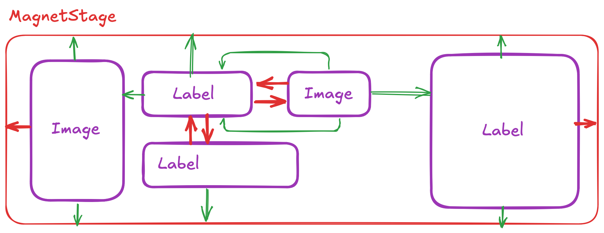

## Layouts [](https://www.nuget.org/packages/Nalu.Maui.Layouts/) [](https://www.nuget.org/packages/Nalu.Maui.Layouts/)

Cross-platform layouts for MAUI applications to simplify dealing with templates and `BindinginContext` in XAML.

Can be added to your project using `.UseNaluLayouts()` on your app builder.

### ViewBox

`ViewBox` is a lightweight replacement for `ContentView` class which is still based on the legacy Xamarin `Compatibility.Layout`.
You can simply use `ViewBox` as base class of your custom views instead of using `ContentView`.

This class also provides a `ContentBindingContext` property that allows you to bind the content to a property of the `ViewBox`'s binding context.
This helps to fulfill interface segregation principle.

On top of that, `ViewBox` offers the possibility to clip the content to the bounds of the view through `IsClippedToBounds` property.

```xml
<nalu:ViewBox ContentBindingContext="{Binding SelectedAnimal}"
              IsVisible="{Binding IsSelected}">
    <views:AnimalView x:DataType="models:Animal" />
</nalu:ViewBox>
```

### TemplateBox

Similarly to `ViewBox` this component holds a view based on `DataTemplate` or `DataTemplateSelector`.

```xml
<nalu:TemplateBox ContentTemplate="{StaticResource AnimalTemplate}" ContentBindingContext="{Binding CurrentAnimal}" />
```
```xml
<nalu:TemplateBox ContentTemplate="{StaticResource AnimalTemplateSelector}" ContentBindingContext="{Binding CurrentAnimal}" />
```

You can also project the content into the template (like you usually do with [ContentPresenter](https://learn.microsoft.com/en-us/dotnet/maui/fundamentals/controltemplate?view=net-maui-8.0#substitute-content-into-a-contentpresenter)).

The following example will display `Projected => I'm here!`.

```xml
<nalu:TemplateBox>

    <nalu:TemplateBox.ContentTemplate>
        <DataTemplate>
            <HorizontalStackLayout>
                <Label Text="Projected => " />
                <nalu:TemplateContentPresenter />
            </HorizontalStackLayout>
        </DataTemplate>
    </nalu:TemplateBox.ContentTemplate>

    <Label Text="I'm here!" />

</nalu:TemplateBox>
```

### ToggleTemplate

Usually to switch between views we use `IsVisible` property, but this is not always the best solution.
Using `IsVisible` still creates the view in the visual tree applying all the bindings (performance impact).
`ToggleTemplate` is a `TemplateBox` that generates a content view based on a boolean value and a corresponding `DataTemplate` (or even `DataTemplateSelector`).

```xml
<nalu:ToggleTemplate Value="{Binding HasPermission}"
                     WhenTrue="{StaticResource AdminFormTemplate}"
                     WhenFalse="{StaticResource PermissionRequestTemplate}" />
```

This can also be used with one single expensive template:
```xml
<nalu:ToggleTemplate Value="{Binding ShowExpensiveTemplate}"
                     WhenTrue="{StaticResource ExpensiveTemplate}" />
```

### ExpanderViewBox

`ExpanderViewBox` is a custom view that fully displays or **collapses** its content by **animating** the size transition.

You can use `+Infinity` collapse size to enable size-change animations.


This component is also useful for scenarios where you want to show or hide additional information dynamically or if you want to build an **accordion** control.

Here's an example of how we can use it to build a section that can be expanded or collapsed through a button only when the content exceeds the `CollapsedHeight`.

```csharp
private void ToggleExpended(object? sender, EventArgs e)
{
    TheExpander.IsExpanded = !TheExpander.IsExpanded;
}
```

```xml
<VerticalStackLayout>

    <!-- This button is only visible when the expander's content is bigger than the collapsed size. -->
    <Button Text="Toggle expanded"
            Clicked="ToggleExpended"
            IsVisible="{Binding Path=CanCollapse,
                                Source={x:Reference TheExpander},
                                x:DataType=nalu:ExpanderViewBox}"/>

    <nalu:ExpanderViewBox x:Name="TheExpander"
                          BackgroundColor="Coral"
                          CollapsedHeight="200">

        <VerticalStackLayout VerticalOptions="Start">
            <Label Text="List of my friends" />
            <!--
                The height of this stack layout depends on the number of friends,
                so the height will change at runtime and may or may not exceed the collapsed height. 
            -->
            <VerticalStackLayout BindableLayout.ItemsSource="{Binding Friends}"
                                 BindableLayout.ItemTemplate="{StaticResource FriendTemplate}" />
        </VerticalStackLayout>

    </nalu:ExpanderViewBox>

</VerticalStackLayout>
```

You can even use `ExpanderViewBox` as a `CollectionView`'s `ItemTemplate` to animate the size change of each item.


```csharp
private void ScrollToMe(object? sender, EventArgs e)
{
    TheCollectionView.ScrollTo((sender as BindableObject)?.BindingContext);
}
```

```xml
<CollectionView ItemsSource="{Binding Items}"
                x:Name="TheCollectionView">
    <CollectionView.ItemTemplate>
        <DataTemplate x:DataType="pageModels:MyItem">
            <nalu:ViewBox Padding="16,8">
                <Border StrokeShape="RoundRectangle 12"
                        BackgroundColor="Coral">
                    <VerticalStackLayout>
                        <nalu:ExpanderViewBox CollapsedHeight="126"
                                              IsExpanded="{Binding IsExpanded}">
                            <VerticalStackLayout Padding="16,8">
                                <Label Text="{Binding Name}" FontSize="Large"/>
                                <Label Text="{Binding Description}"/>
                            </VerticalStackLayout>
                        </nalu:ExpanderViewBox>
                        <Button Text="Toggle"
                                BackgroundColor="Coral"
                                TextColor="Black"
                                Clicked="ScrollToMe"
                                Command="{Binding ToggleCommand}"/>
                    </VerticalStackLayout>
                </Border>
            </nalu:ViewBox>
        </DataTemplate>
    </CollectionView.ItemTemplate>
</CollectionView>
```

### Popups

Nalu.Maui provides a flexible and customizable way to implement popups in your MAUI applications.
Popups are non other than `ContentPage`s with transparent background and a few key properties.

Nalu offers a built-in `PopupPageBase` class, which creates a modal page with a scrim (background overlay) and a styled container for your popup content.

A `CloseOnScrimTapped` property is available to control whether the popup should close when the scrim is tapped: you can bind it to a boolean property in your view model or set it directly in XAML.

#### Styling the popups

The base style for popups can be defined in your `Styles.xaml` file, allowing you to customize the appearance of all popups in your application.

```xml
<Style TargetType="nalu:PopupScrim">
    <Setter Property="BackgroundColor" Value="{AppThemeBinding Light='#20000000', Dark='#20FFFFFF'}" />
</Style>

<Style TargetType="nalu:PopupContainer">
    <Setter Property="Background" Value="{AppThemeBinding Light={StaticResource White}, Dark={StaticResource OffBlack}}" />
    <Setter Property="Margin" Value="16" />
    <Setter Property="StrokeShape" Value="RoundRectangle 24" />
    <Setter Property="StrokeThickness" Value="0" />
    <Setter Property="VerticalOptions" Value="Center" />
    <Setter Property="HorizontalOptions" Value="Center" />
</Style>
```

#### Creating a Popup
To create a popup, inherit from `PopupPageBase` and set your content via the `PopupContent` property (in XAML or code). You can style the popup using the provided `PopupContainer` and `PopupScrim` types.

```xml
<?xml version="1.0" encoding="utf-8"?>

<nlayouts:PopupPageBase xmlns="http://schemas.microsoft.com/dotnet/2021/maui"
                        xmlns:x="http://schemas.microsoft.com/winfx/2009/xaml"
                        xmlns:popupModels="clr-namespace:MyNamespace.PopupModels"
                        xmlns:nlayouts="https://nalu-development.github.com/nalu/layouts"
                        x:Class="MyNamespace.YesNoPopupPage"
                        x:DataType="popupModels:YesNoPopupPageModel"
                        CloseOnScrimTapped="True">
    <VerticalStackLayout Padding="16">
        <Label Text="Do you want to proceed?"
               FontSize="24"
               HorizontalOptions="Center" />
        <HorizontalStackLayout HorizontalOptions="End">
            <Button Text="Cancel"
                    Command="{Binding Path=NoCommand}"
                    Margin="0,0,16,0" />
            <Button Text="OK"
                    Command="{Binding Path=YesCommand}" />
        </HorizontalStackLayout>
    </VerticalStackLayout>
</nlayouts:PopupPageBase>
```

#### Using Popups with Nalu.Maui.Navigation

First of all the popup page and page model must follow the same naming convention as other pages and page models in your application.
If you want to use a different one, you have to register them manually in the Nalu navigation builder.

Define a handy base class for your popup models: in the following example we use the community toolkit MVVM `ObservableObject` as base class, but you can use any other base class that fits your needs.

```csharp
using CommunityToolkit.Mvvm.ComponentModel;

namespace Nalu.Maui.Weather.PopupModels;

public abstract class PopupModelBase<TIntent, TResult>(INavigationService navigationService) : ObservableObject, IEnteringAware<TIntent>
    where TIntent : AwaitableIntent<TResult>
{
    protected TIntent PopupIntent { get; private set; } = null!;

    public virtual ValueTask OnEnteringAsync(TIntent intent)
    {
        PopupIntent = intent;
        return ValueTask.CompletedTask;
    }

    protected async Task CloseAsync()
    {
        await navigationService.GoToAsync(Navigation.Relative().Pop());
    }

    protected Task CloseAsync(TResult result)
    {
        PopupIntent.SetResult(result);
        return CloseAsync();
    }

    protected Task CloseFaultyAsync(Exception exception)
    {
        PopupIntent.SetException(exception);
        return CloseAsync();
    }
}
```

Now define our awaitable intent for the popup. This intent will be used to pass parameters to the popup and to await the result.

In the following example we don't have any specific parameters to pass, but you can extend the intent class to include any necessary properties.

```csharp
public class YesNoIntent : AwaitableIntent<bool?>;
```

And use it in the corresponding popup model:

```csharp
public partial class YesNoPopupModel(INavigationService navigationService) : PopupModelBase<DurationEditIntent, TimeSpan?>(navigationService)
{
    [RelayCommand]
    public async Task YesAsync() => await CloseAsync(true);

    [RelayCommand]
    public async Task NoAsync() => await CloseAsync(false);
}
```

Now we can leverage the Nalu's navigation service to show the popup and await the result.

```csharp
var response = await navigationService.ResolveIntentAsync<YesNoPopupModel, bool?>(new YesNoIntent());
```

If you just want to await for the popup to close without caring about the result, you can use the non-generic `AwaitableIntent` instead.

Easy right? You can now use this pattern to create any kind of popup in your application.

### Magnet

`Magnet` is a powerful **constraint-based** layout that allows you to create complex layouts with ease by defining constraints.



The documentation is not yet available here, but you can [look at this presentation](https://docs.google.com/presentation/d/1VkKodflxRsIWdPN8ZgwiQKUBybEszTV3gXBW4cIiEqs/edit?usp=sharing).

Keep in mind this layout is in **alpha/preview** state so its API may be subject to change.

Here's a performance comparison between `GridLayout` and `MagnetLayout` considering two scenarios:
1. **Dynamic measure**: All the views keep chaining their size on each measure pass (rare case)
2. **Constant measure**: The views always return the same size (very common)

```
for (var i = 0; i < _iterations; i++)
{
    var result = _layoutManager.Measure(500, 500);
    _layoutManager.ArrangeChildren(new Rect(Point.Zero, result));
}
```

| Method                          | Mean     | Error     | StdDev    | Gen0     | Allocated |
|-------------------------------- |---------:|----------:|----------:|---------:|----------:|
| GridLayoutPerf                  | 2.332 ms | 0.0206 ms | 0.0183 ms | 222.6563 |   1.78 MB |
| MagnetLayoutPerf                | 6.747 ms | 0.0444 ms | 0.0393 ms | 273.4375 |   2.21 MB |
| GridLayoutConstantMeasurePerf   | 1.388 ms | 0.0221 ms | 0.0207 ms | 166.0156 |   1.33 MB |
| MagnetLayoutConstantMeasurePerf | 2.756 ms | 0.0211 ms | 0.0176 ms | 218.7500 |   1.75 MB |
  
As we can see `Magnet` is about 2 times slower than `Grid` but it provides a lot of flexibility and power.
So it's up to you to decide whether to use `Magnet` or the standard MAUI layouts.

On a common page with a few views, the performance impact is negligible while the flexibility gain is huge in comparison.

Inside a `CollectionView` template is probably better to use MAUI layouts, but that still needs to be verified with real data
considering that you may be forced to use nested layouts to achieve the same result and that also comes with a non-negligible performance cost.

**Important:**
- in a `CollectionView` template, make sure your `Stage` property references a `MagnetStage` defined outside the template (aka `Resources`)
- at the moment it is not supported to change the `MagnetStage` content at runtime
