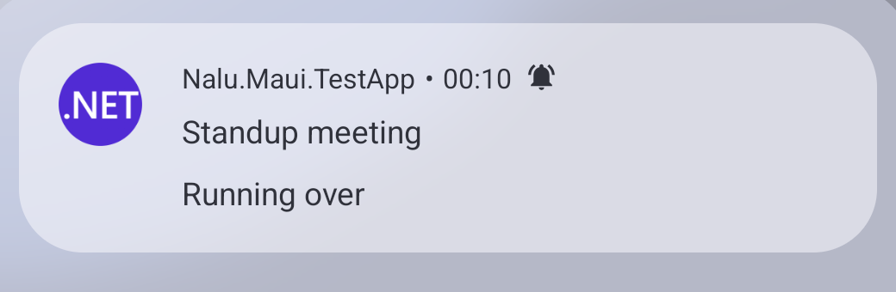
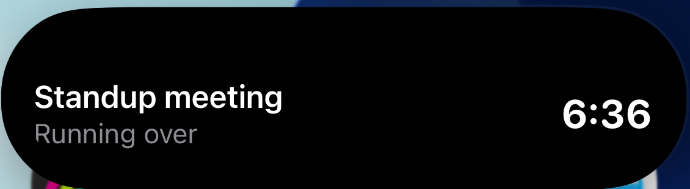

# Timers

The single most important fact about live activity timers: **the operating system ticks
them, not your app**. You hand over absolute instants once, and iOS renders
`Text(timerInterval:)` out of process (not even the widget extension executes per tick)
while Android's SystemUI drives the notification chronometer. Zero app wake-ups, zero
battery attributed to you, and the clock keeps running after your process dies.

That is why the API takes **`DateTimeOffset` anchors, never durations** — an instant stays
correct forever; a duration would drift and die with the process:

```csharp
Timer = LiveActivityTimer.CountDown(order.Eta);         // ticks down to the instant
Timer = LiveActivityTimer.CountUp(workout.StartedAt);   // ticks up from the instant
Timer = LiveActivityTimer.Paused(elapsedSoFar);         // frozen display
```

The mental model: **timestamps in, ticking UI out — updates are for state changes, not for
time passing.** A 40-minute delivery ETA costs exactly one `StartAsync`; the display stays
correct the whole ride with no further calls.

## Pausing and resuming

Neither OS can freeze a ticking clock in place, so pausing is a (single) state change:

```csharp
// Pause: replace the ticking clock with a frozen elapsed display.
await activity.UpdateAsync(c => c.Timer = LiveActivityTimer.Paused(DateTimeOffset.UtcNow - startedAt));

// Resume: recompute the anchor so the clock continues from where it stopped.
await activity.UpdateAsync(c => c.Timer = LiveActivityTimer.CountUp(DateTimeOffset.UtcNow - pausedElapsed));
```

## When the countdown reaches zero

Nothing happens — by design, on both platforms. **Reaching zero is not an event**: no
callback fires, the activity does not end, and no code of yours runs. "The timer hit zero"
and "the pizza actually arrived" are different facts; only your app knows the second one.

What each platform *displays* past the end:

| | Android | iOS |
|---|---|---|
| Native behavior | chronometer counts **into negatives** (−08:30) | rendered text **stops at 0:00** |
| With `StaleAt = endsAt` | (unchanged) | system re-renders at that instant → widget flips to **negative overflow** (−0:01 and counting) |

That second row is the one system-side trigger iOS offers. ActivityKit's `staleDate` (our
`StaleAt`) makes the **system re-render the widget** when the instant passes — no app code
runs, but the re-render is enough for the bundled widget to notice the end is in the past
and switch to the negative display. One line makes iOS match Android end to end, even with
your app dead:

```csharp
Timer = LiveActivityTimer.CountDown(eta),
StaleAt = eta,   // boundary re-render: countdown flips to −overflow by itself
```

> [!NOTE]
> `StaleAt` does double duty: it also transitions the handle to
> `LiveActivityState.Stale`, its original meaning of "this content is now outdated". Only
> point it at the countdown end when the overflow flip is what you want.

## Changing *meaning* at the boundary

Rendering is one thing; **semantics** are another. When crossing zero should change what
the activity *says* — "Time remaining" becoming "Running over", green becoming red, an
alert firing — that is an app-owned update at the boundary:

```csharp
// While the appointment runs: green countdown.
Timer = LiveActivityTimer.CountDown(appointmentEnd);

// At the boundary (your own scheduled task while the app lives):
await activity.UpdateAsync(
    c =>
    {
        c.Subtitle = "Running over";
        c.AccentColor = "#E5484D";
        c.Timer = LiveActivityTimer.CountUp(appointmentEnd);   // overflow ticks up natively
    },
    new LiveActivityAlert("Appointment is running over"));
```

After that single update the OS ticks the overflow forever — no matter how long the meeting
runs over, you never send another update for time passing:

<p>
  
  
</p>

The full decision ladder:

1. **Rendering-only boundary** → `StaleAt = endsAt`; the system handles it, app can be dead.
2. **Semantic boundary, app alive** → schedule your own clock and send one update (above).
3. **Semantic boundary, app dead** → only a server push can do it; iOS has no
   wake-me-at-time-X primitive for suspended apps. (Push-driven updates are on the roadmap.)

The TestApp's **"Live Activity Timer Tests"** page is the runnable version of this chapter:
a 2-minute appointment counting down, flipping to red overflow automatically at the end (or
on demand via *Overflow now*).
