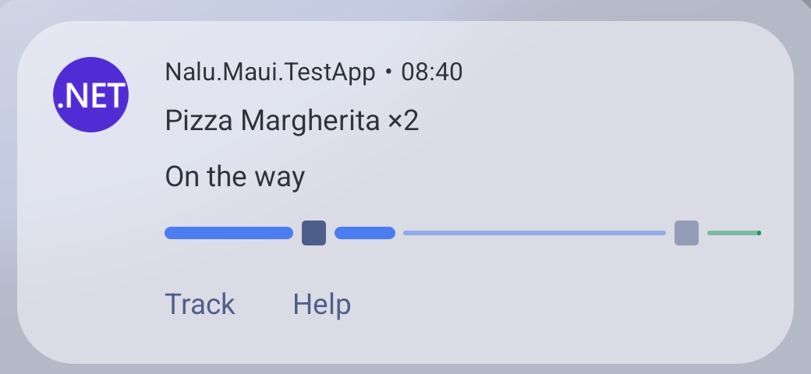
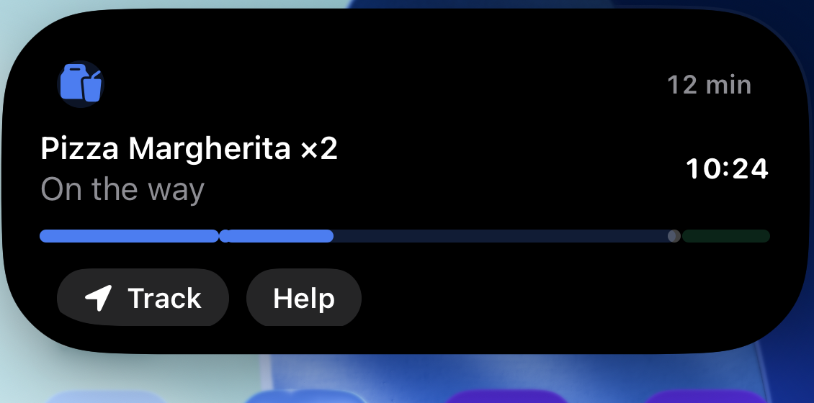
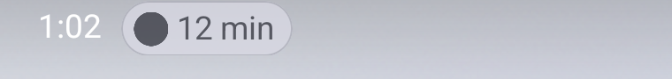
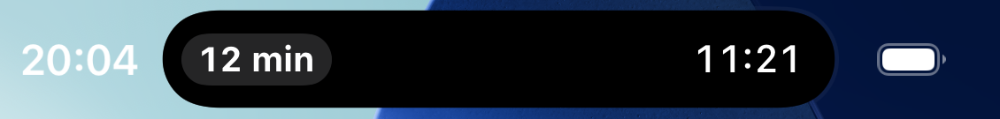

# Live Activities

`Nalu.Maui.LiveActivities` shows your app's **live, glanceable state on the system surfaces**
of both platforms from one C# API:

- **iOS**: a real ActivityKit **Live Activity** — Lock Screen banner plus the Dynamic Island
  (compact chip, expanded card) — rendered by a widget extension the package **builds and
  embeds automatically** (you write no Swift and touch no Xcode).
- **Android 16+**: a **Live Update** — the promoted ongoing notification with the status-bar
  chip and the floating card. Android 8–15 degrades gracefully to a plain ongoing
  notification with a classic progress bar and chronometer.

The design principle is a **semantic content model**: you describe *what the activity says*
— title, chip, progress, a ticking timer, actions — and each platform renders it natively in
its own visual language. Both platforms end up with the same information in the same roles,
because the model *is* the intersection of what they can render. One content, two systems:

<p>
  
  
</p>

```csharp
var activity = await liveActivities.StartAsync("delivery", new LiveActivityContent
{
    Title = "Pizza on the way",
    Subtitle = "Preparing your order",
    ChipText = "10%",
    AccentColor = "#4C7DF0",
    Progress = new LiveActivityProgress { Value = 0.1 },
    Timer = LiveActivityTimer.CountDown(order.Eta),
});

await activity.UpdateAsync(c =>
{
    c.Subtitle = "On the way";
    c.ChipText = "60%";
    c.Progress!.Value = 0.6;
});

await activity.EndAsync(c =>
{
    c.Title = "Delivered";
    c.Subtitle = "Enjoy!";
    c.Progress = null;
    c.Timer = null;
});
```

## Setup

```csharp
builder.UseNaluLiveActivities(live => live
    .AddKind("delivery", "Order tracking")   // Android notification channel name
);
```

Resolve `ILiveActivityManager` from DI wherever you need it.

On iOS, declare Live Activity support in `Platforms/iOS/Info.plist`:

```xml
<key>NSSupportsLiveActivities</key>
<true/>
```

That is the whole setup on iOS: with the key declared, the NuGet package builds + embeds a
generic WidgetKit extension rendering the content model — Lock Screen, Dynamic Island,
everything. Forget the key and the **build fails with `NALU001`** telling you exactly what
to add — the package validates the compiled app manifest so the mistake can never reach
ActivityKit's cryptic runtime error.

On Android there is **nothing to add to your manifest**: the package declares

- `android.permission.POST_NOTIFICATIONS` (the runtime-prompted notification permission), and
- `android.permission.POST_PROMOTED_NOTIFICATIONS` (the install-time grant that allows
  Live Update promotion)

via assembly-level `[UsesPermission]` attributes, and Android's standard manifest merge
carries both into your app — the same first-class mechanism every Android library uses
(verify with `aapt2 dump` on the built APK if in doubt). Your only job is triggering the
runtime prompt:

```csharp
var allowed = await liveActivities.RequestPermissionAsync();
```

> [!NOTE]
> On Android this requests `POST_NOTIFICATIONS` (Android 13+). On iOS there is no runtime
> prompt — the user controls Live Activities per app in Settings, and the call simply
> reflects that switch.

### Support levels

```csharp
switch (liveActivities.Support)
{
    case LiveActivitySupport.Full:        // iOS 16.2+ · Android 16 QPR1+ (chip + floating card)
    case LiveActivitySupport.Degraded:    // Android 8 – 16 base: plain ongoing notification, no chip
    case LiveActivitySupport.Unavailable: // iOS < 16.2, Mac Catalyst, Windows, or user-disabled
}
```

> [!NOTE]
> The Live Update chip needs **Android 16 QPR1 (API 36.1)** — the promotion API does not
> exist on base Android 16, so devices that have not received QPR1 yet (common on OEM
> schedules) report `Degraded` and show the plain ongoing notification. The chip's exact
> look also follows the vendor's skin. Users can additionally veto promotion per app
> (notification settings → "Live updates" / promoted notifications).

Calls are **never** platform-branched in your code: on `Unavailable` surfaces `StartAsync`
returns an inert handle and every call is a no-op, so the same code path runs everywhere.
Set `DisableAndroidFallback = true` in the options if the chip is essential to your feature
and a chip-less notification would mislead.

## The API shape

The handle is **write-mostly** and every mutation goes through a *patch lambda*:

```csharp
public interface ILiveActivity
{
    string Id { get; }
    string Kind { get; }
    LiveActivityState State { get; }          // Active, Stale, Ended, Dismissed
    ILiveActivityContent Content { get; }     // read-only view of the last applied snapshot

    event EventHandler? Dismissed;            // the user removed it from screen

    Task UpdateAsync(Action<LiveActivityContent> patch, LiveActivityAlert? alert = null);
    Task EndAsync(Action<LiveActivityContent>? finalPatch = null,
                  LiveActivityDismissal dismissal = LiveActivityDismissal.Default);
}
```

Why lambdas instead of passing content objects around:

- The library deep-clones the current snapshot into a **draft**, runs your patch on it under
  the handle's lock, and applies the result. Reading and writing happen on the freshest
  state, concurrent updates serialize cleanly, and the patch must be synchronous.
- A patch that produces **identical content is skipped entirely** — both OSes budget
  live-activity updates, so no-op suppression is built in.
- `Content` is the read-only view of the last applied snapshot (its main use is
  [reconciliation](#activities-outlive-your-app)); your own model stays the source of truth.

Updates are **silent by default**. Pass an alert to draw attention (iOS Live Activity alert,
Android re-notify):

```csharp
await activity.UpdateAsync(
    c => c.Subtitle = "Driver is at the door",
    new LiveActivityAlert("Driver arrived", "Meet them at the door"));
```

Ending mirrors iOS semantics on both platforms: the **default dismissal keeps the final
content visible** for a while (Android converts it to a regular swipeable notification),
while `LiveActivityDismissal.Immediate` removes it instantly.

## The content model, mapped

| Property | Android (Live Update) | iOS (widget) |
|---|---|---|
| `Title` / `Subtitle` | notification title / text | card headline / secondary line |
| `SubtitleOverflow` | subtitle once a countdown runs over (from the next post) | subtitle once a countdown runs over (system-side with `StaleAt`) — see [timers](liveactivities-timers.md#when-the-countdown-reaches-zero) |
| `ChipText` | status-bar chip text (`setShortCriticalText`) | Dynamic Island compact pill; expanded-card corner caption |
| `ChipIcon` | — (chip shows the small icon) | identity glyph (SF Symbol name) in card + minimal island |
| `AccentColor` | small-icon tint + progress bar color | progress track + identity glyph tint — **nothing else**, see below |
| `ImageName` | large icon (drawable name) | — (reserved) |
| `Progress` | `ProgressStyle` bar: segments, points, tracker icon | segmented capsule track with milestone dots |
| `Timer` | native chronometer (header) | native ticking text (`Text(timerInterval:)`) |
| `DeepLink` | tap intent | `widgetURL` |
| `Actions` | notification action buttons | capsule `Link` buttons |
| `StaleAt` | *(marks handle `Stale` on rehydration)* | ActivityKit `staleDate` — also the [zero-crossing trigger](liveactivities-timers.md#when-the-countdown-reaches-zero) |
| `Custom` | ignored | forwarded verbatim to [custom widget UIs](#custom-ios-ui) |

Keep `ChipText` under ~7 characters ("12 min", "3–2", "60%") — it lives in the tiny
always-visible surface on both platforms:

<p>
  
  
</p>

### Progress with steps

Yes — progress is not just a fraction. The model adopts Android 16's `ProgressStyle` shape,
and the iOS widget renders the same structure:

- **`Segments`** — weighted, individually colorable stretches of the bar (phases of a
  journey: *preparing · driving · delivering*);
- **`Points`** — milestone markers at positions along the bar, filled once passed;
- **`TrackerIcon`** — an icon travelling with the progress (Android only);
- **`Indeterminate`** — a waiting bar while the real extent is unknown.

See the [delivery example](liveactivities-examples.md#delivery-with-steps) for the full
pattern.

### Colors are deliberately constrained

Android's Live Update is a **system template**: text, chip and card background are always
system-colored (and adapt to dark/light on their own); the app only colors the progress bar
and tints its identity icon. The iOS widget **enforces the same contract** — `AccentColor`
applies to the progress track and the identity glyph, nothing else — so the customization
surface is identical on both platforms and both inherit dark/light adaptivity from the
system. If you need more than that on iOS, bring [your own widget UI](#custom-ios-ui).

## The user can always take it away

Neither platform lets you pin a live activity on screen, and this is deliberate. Android 14
changed `setOngoing(true)` so ongoing notifications became dismissable for **all apps,
regardless of `targetSdkVersion`** — the only carve-outs are `CallStyle`, media, and
enterprise device-policy notifications, none of which a live activity qualifies for. Android
16's Live Updates kept that: Google's guidance is explicitly *don't repost what the user
dismissed*, because reposting is what makes people revoke the app's posting permission
outright. iOS is the same story — a Live Activity can be cleared from the Lock Screen.

Nalu absorbs this for you. When the user removes it:

- `State` becomes `LiveActivityState.Dismissed` and the `Dismissed` event fires (on the main
  thread, on both platforms).
- Further `UpdateAsync` calls become **silent no-ops** — they do not throw the way an ended
  handle does, so a progress loop can keep running untouched. `Content` still advances, so
  the snapshot stays truthful.
- `EndAsync` seals the handle to `Ended` without touching the platform — important because
  the default dismissal *posts* the final content, which would drag the notification the user
  just swiped straight back.

You only need the event if something should stop when the activity goes away:

```csharp
activity.Dismissed += (_, _) => _progressTimer.Stop();
```

Under the hood this is a delete intent on Android and an ActivityKit state observer on iOS;
neither reaches your code. Note the asymmetry it papers over: Android would genuinely
resurrect the notification on the next `notify()`, while ActivityKit merely ignores updates —
without this, the same app code would behave differently per platform.

## …but not forever, and not everywhere

Two iOS limits are worth knowing before you design around a Live Activity, because neither is
something the content model can influence.

**A Live Activity lives about 8 hours.** After that iOS ends it on its own, removing it from the
Dynamic Island immediately and from the Lock Screen a few hours later. A timer longer than that
will always outlive its activity, and an activity left running overnight is simply gone by
morning — not broken, ended. If your session can outlast the limit, end it and start a fresh one
rather than expecting a single activity to span a day.

Note this is about the activity's own AGE, not the timer's length: ActivityKit accepts a
countdown of any duration, including one whose end is already in the past (verified on device
from 48 hours ahead to 22 hours elapsed), and the widget renders an elapsed range correctly.

**The Dynamic Island needs an iPhone 14 Pro or later.** On a notch device — iPhone 13 and
earlier — Live Activities are fully supported but only ever appear on the **Lock Screen** and as
alert banners; the compact and minimal presentations have nowhere to draw. If you are testing
and "nothing shows up near the notch", check the device before the code. An iPhone 15/16 Pro
simulator renders all three presentations.

> [!TIP]
> A foreground app never shows its own Live Activity. Background the app (or lock the device) to
> see it at all — a start call that returned successfully is not evidence that anything was
> presented.

## Activities outlive your app

This is a feature, not a leak: a delivery keeps its Live Activity when the app dies, on both
platforms. The consequence: **reconcile on startup**. `ILiveActivityManager.Activities`
rehydrates surviving activities (from ActivityKit on iOS, from the notification's own extras
on Android) — adopt yours instead of starting a duplicate next to it:

```csharp
var existing = liveActivities.Activities
    .LastOrDefault(a => a.Kind == "delivery"
                        && a.State is LiveActivityState.Active or LiveActivityState.Stale);

if (existing is not null)
{
    _activity = existing;                                 // continue updating it
    _progress = existing.Content.Progress?.Value ?? 0;    // restore what you need
}
```

An adopted handle is fully functional — `UpdateAsync` continues the same notification /
activity seamlessly.

## Custom iOS UI

The bundled widget is a deliberately clean default. When your activity deserves bespoke
SwiftUI, copy the package's widget project and point the build at it:

```xml
<PropertyGroup>
  <NaluLiveActivitiesWidgetProject>$(MSBuildProjectDirectory)/MyWidget/MyWidget.xcodeproj</NaluLiveActivitiesWidgetProject>
</PropertyGroup>
```

Rules of the road: keep the `NaluLiveActivityAttributes` struct **exactly as shipped**
(ActivityKit matches activities to widgets by that type), decode the same JSON payload, and
switch layouts on `kind`. The `Custom` dictionary travels untouched for anything your UI
needs beyond the standard model. Other knobs: `NaluLiveActivitiesWidget=false` disables the
automatic widget entirely; `NaluLiveActivitiesWidgetBundleSuffix` and
`...WidgetDisplayName` tune identity.

> [!IMPORTANT]
> Device and App Store builds need the usual per-bundle-id provisioning for the widget
> extension (`$(ApplicationId).widget` by default) on the Apple developer portal — that is
> an Apple requirement for any app extension, not something the package can automate.

## Actions

Actions are **deep links** in v1 — a label, an optional icon, and a URL your app handles:

```csharp
Actions =
[
    new LiveActivityAction { Id = "track", Label = "Track", Icon = "location.fill", DeepLink = "myapp://track" },
    new LiveActivityAction { Id = "help",  Label = "Help",  DeepLink = "myapp://help" },
]
```

Both platforms render them as buttons; tapping opens the app at the link. There are no
in-process callbacks yet: an action with an `Id` but **no `DeepLink` is valid to declare
today but not rendered** — it is reserved for the upcoming direct-callback support, which
will report taps back through that `Id` without opening the app.

> [!WARNING]
> **Every deep link — the content-level `DeepLink` and each action's — needs its scheme
> registered by your app, and an unregistered scheme fails SILENTLY**: the tap is
> delivered, resolves to nothing, and the app never opens. Register it on iOS via
> `CFBundleURLTypes` in `Info.plist` and on Android on your `MainActivity`:
>
> ```csharp
> [IntentFilter([Intent.ActionView],
>     Categories = [Intent.CategoryDefault, Intent.CategoryBrowsable],
>     DataScheme = "myapp")]
> public class MainActivity : MauiAppCompatActivity { ... }
> ```
>
> Omitting `DeepLink` on the content is always safe: tapping then simply foregrounds the
> app (Android falls back to the launch intent; iOS opens the app by default).

> [!NOTE]
> **Android 16: an action tap leaves the expanded chip card on screen.** Tapping the
> status-bar chip of a Live Update opens a floating card; tapping the card's *body* (the
> content `DeepLink`) opens your app and closes the card, but tapping an *action button*
> opens your app **behind** a card that stays up until it is dismissed or times out. That is
> SystemUI's own behaviour — a notification cannot close that surface, and
> `ACTION_CLOSE_SYSTEM_DIALOGS` has been blocked for apps since Android 12. If a single tap
> target matters more than buttons for your feature, put it on the content `DeepLink`.

## Where to next

- [Timers](liveactivities-timers.md) — the OS ticks, you don't: count-downs, count-ups,
  pausing, and what happens at zero.
- [Use cases](liveactivities-examples.md) — delivery with steps, appointments that run
  over, workouts, downloads, live scores.
