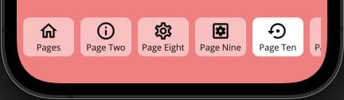
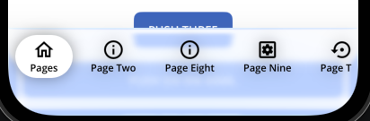

# Custom Tab Bar

> **Note**: The custom tab bar feature is **independent** of Nalu's MVVM navigation system. It can be used with **standard MAUI Shell** as well as `NaluShell`.

Nalu provides a custom `Shell` handler implementation that allows you to replace the native tab bar with a fully customizable cross-platform view.
This is especially useful when you need more than 5 tabs (avoiding the native "More" tab on iOS) or want complete control over tab bar styling.

This feature also solves the issues `Shell` has with pages under the iOS `More` tab.



**Platform support**: Android, iOS, and MacCatalyst only.
**Edge-to-edge**: The custom tab bar allows edge-to-edge behavior when supported (iOS: always, Android: starting from .NET10).

## Quick Start

### Setup

1. Enable the custom tab bar handler in `MauiProgram.cs`:

```csharp
builder
    .UseMauiApp<App>()
    // Optional: Only if using Nalu navigation
    .UseNaluNavigation<App>(nav => nav.AddPages())
#if IOS || ANDROID || MACCATALYST
    .UseNaluTabBar()  // Works with both standard Shell and NaluShell
#endif
```

2. Create a custom tab bar class by creating a new XAML file (e.g., `AppShellTabBar.xaml`):

You can use what Nalu provides (`NaluTabBar`) or create your own custom component.
**Note**: This instance will be bound to its `ShellItem` (a.k.a `TabBar`).

```xml
<?xml version="1.0" encoding="utf-8"?>

<nalu:NaluTabBar xmlns="http://schemas.microsoft.com/dotnet/2021/maui"
                 xmlns:x="http://schemas.microsoft.com/winfx/2009/xaml"
                 xmlns:nalu="https://nalu-development.github.com/nalu/navigation"
                 x:Class="MyApp.AppShellTabBar"
                 BarShadow="{Shadow Radius=16, Opacity=0.4}"
                 HeightRequest="64"
                 Padding="4"
                 BarBackground="#CC2C479D"
                 BarStrokeShape="RoundRectangle 32"
                 TabStrokeShape="RoundRectangle 32"
                 TabPadding="12,4"
                 TabFontFamily="OpenSansSemibold"
                 ActiveTabStrokeShape="RoundRectangle 32"
                 ActiveTabPadding="12,4"
                 ActiveTabFontFamily="OpenSansSemibold"
                 BarPadding="0"
                 ScrollPadding="4" />
```

3. Create the code-behind file (e.g., `AppShellTabBar.xaml.cs`):

```csharp
namespace MyApp;

public partial class AppShellTabBar : NaluTabBar
{
    static AppShellTabBar()
    {
#if IOS || ANDROID || MACCATALYST
        NaluTabBar.UseBlurEffect = true;  // Optional: Enable blur effect
#endif
    }
    
    public AppShellTabBar()
    {
        InitializeComponent();
    }
}
```

4. Attach the custom tab bar view to your `TabBar` or `FlyoutItem`:

**With standard Shell:**
```xml
<Shell xmlns="http://schemas.microsoft.com/dotnet/2021/maui"
       xmlns:x="http://schemas.microsoft.com/winfx/2009/xaml"
       xmlns:nalu="https://nalu-development.github.com/nalu/navigation"
       xmlns:sample="clr-namespace:MyApp"
       x:Class="MyApp.AppShell">
    <TabBar nalu:NaluShell.TabBarView="{sample:AppShellTabBar}">
        <ShellContent Title="Home"
                      Icon="{FontImageSource FontFamily='MaterialOutlined', Glyph='&#xe88a;', Size=24}" />
        <ShellContent Title="Search"
                      Icon="{FontImageSource FontFamily='MaterialOutlined', Glyph='&#xe8b6;', Size=24}" />
        <!-- Add as many tabs as needed - no "More" tab limitation! -->
    </TabBar>
</Shell>
```

**With NaluShell:**
```xml
<nalu:NaluShell xmlns="http://schemas.microsoft.com/dotnet/2021/maui"
                 xmlns:nalu="https://nalu-development.github.com/nalu/navigation"
                 xmlns:pages="clr-namespace:MyApp.Pages"
                 xmlns:sample="clr-namespace:MyApp"
                 x:Class="MyApp.AppShell">
    <FlyoutItem nalu:NaluShell.TabBarView="{sample:AppShellTabBar}">
        <ShellContent nalu:Navigation.PageType="pages:HomePage"
                      Title="Home"
                      Icon="{FontImageSource FontFamily='MaterialOutlined', Glyph='&#xe88a;', Size=24}" />
        <!-- More ShellContent items -->
    </FlyoutItem>
</nalu:NaluShell>
```

### Styling Properties

The `NaluTabBar` control provides extensive styling options:

**Bar Properties** (container):
- `BarBackground` - Background brush for the tab bar container
- `BarPadding` - Padding around the tab bar container
- `BarMargin` - Margin around the tab bar container
- `BarStroke` - Stroke brush for the container border
- `BarStrokeThickness` - Thickness of the container border
- `BarStrokeShape` - Shape of the container border
- `BarShadow` - Shadow effect for the tab bar container

**Tab Properties** (individual tabs):
- `TabBackground` - Background brush for inactive tabs
- `TabForegroundColor` - Text color for inactive tabs
- `TabStroke` - Stroke brush for inactive tab borders
- `TabStrokeThickness` - Thickness of inactive tab borders
- `TabStrokeShape` - Shape of inactive tab borders
- `TabPadding` - Padding for inactive tab buttons
- `TabFontFamily` - Font family for inactive tab labels

**Active Tab Properties**:
- `ActiveTabBackground` - Background brush for the active tab
- `ActiveTabForegroundColor` - Text color for the active tab
- `ActiveTabStroke` - Stroke brush for the active tab border
- `ActiveTabStrokeThickness` - Thickness of the active tab border
- `ActiveTabStrokeShape` - Shape of the active tab border
- `ActiveTabPadding` - Padding for active tab buttons
- `ActiveTabFontFamily` - Font family for active tab labels

**Scroll Properties**:
- `ScrollPadding` - Padding for the scroll view container

### Tab Bar Scrim View

The `TabBarScrimView` attached property allows you to overlay a custom view on top of the navigation area while sharing the same safe area insets as the tab bar. This is particularly useful when you want to display popups, overlays, or additional controls (such as a "More" menu) that need to appear above the tab content.

**Usage Example:**

```xml
<TabBar nalu:NaluShell.TabBarView="{sample:AppShellTabBar}"
        nalu:NaluShell.TabBarScrimView="{sample:TabBarMorePopup}">
    <ShellContent Title="Home"
                  Icon="{FontImageSource FontFamily='MaterialOutlined', Glyph='&#xe88a;', Size=24}" />
    <!-- More tabs... -->
</TabBar>
```

The scrim view will:
- Be positioned above the main navigation content
- Respect the same safe area insets as the main navigation content
- Have its `BindingContext` automatically set to the `ShellItem` (TabBar or FlyoutItem)

**Common Use Cases:**
- Displaying a "More" menu popup when there are many tabs
- Showing contextual overlays that relate to tab navigation
- Adding custom interactive elements that need to appear above the page content

### Blur/Glass Effect

The custom tab bar supports a native blur/glass effect that creates a modern, translucent appearance similar to system tab bars. The effect blurs the content behind the tab bar, creating a frosted glass appearance. On iOS 26+ and MacCatalyst 26+, a native glass effect is used for an enhanced visual experience.



**Enabling Blur Effect:**

Enable the blur effect by setting `NaluTabBar.UseBlurEffect` to `true` in your tab bar's static constructor:

```csharp
static AppShellTabBar()
{
#if IOS || ANDROID || MACCATALYST
    NaluTabBar.UseBlurEffect = true;
#endif
}
```

**Platform-Specific Customization:**

**iOS/MacCatalyst:**
- `NaluTabBar.BlurEffectFactory` - Factory method to create the blur/glass effect. On iOS 26+ and MacCatalyst 26+, creates a `UIGlassEffect`; on earlier versions, creates a `UIBlurEffect` with `UIBlurEffectStyle.Light` (default)
- `NaluTabBar.BlurMaskFactory` - Factory method to create a custom mask layer for the blur effect (default: `null`). **Note:** Effects work properly only with a fully opaque layer. Using a mask may lead to unexpected results, so use with caution.

**Android:**
- `NaluTabBar.DefaultBlurRadius` - Default blur radius in device-independent units (default: 8)
- `NaluTabBar.BlurEffectFactory` - Factory method to create the blur effect (only invoked on Android 12/API 31+)
- `NaluTabBar.BlurShaderFactory` - Factory method to create a mask layer for the blur effect (default: vertical gradient from transparent to white)

**Note:** The blur effect requires .NET 10 on all platforms. On Android, it additionally requires Android 12 (API level 31) or higher. On older Android versions or when using .NET versions prior to .NET 10, the blur effect will be automatically disabled.

## Benefits

- ✅ **Fully customizable styling** - Size, colors, shapes, spacing, shadows, fonts, and more
- ✅ **Native blur effect** - Modern translucent appearance with native blur support (requires .NET 10; Android additionally requires API 31+)
- ✅ **Cross-platform consistent appearance** - Same look on all platforms (except Windows)
- ✅ **Independent feature** - Can be used even without Nalu navigation
- ✅ **Edge-to-Edge** - Supports edge to edge by default acting like a system bar

## See Also

- [Navigation Overview](navigation.md) - Learn about Nalu's MVVM navigation system
- [Navigation Lifecycle](navigation-lifecycle.md) - Understanding page lifecycle events
- [Navigation Intents](navigation-intents.md) - Passing data between pages

