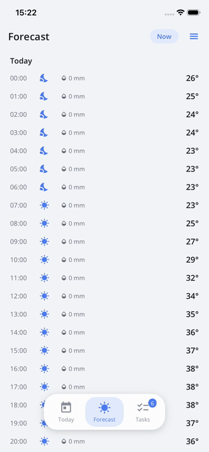

# Scaffold Flyouts (Drawers)

The Scaffold supports **two independent drawers** — start and end side — with scrim,
slide-in animation, RTL awareness and engine-routed selection. "It's just a drawer": any MAUI
view can be the content.



*The sample's Forecast page presents a page-level END drawer with custom content; the scrim
fades, the drawer slides, and scrim tap dismisses.*

## Enabling a drawer

Drawers are **opt-in**: content alone is not enough, the side's *mode* must allow it.

```xml
<nalu:Scaffold nalu:Scaffold.FlyoutStartMode="Flyout">
    <nalu:Scaffold.FlyoutStart>
        <nalu:ScaffoldFlyoutMenuView />
    </nalu:Scaffold.FlyoutStart>
    ...
</nalu:Scaffold>
```

| `ScaffoldFlyoutMode` | Behavior |
|----------------------|----------|
| `Disabled` (default) | No drawer, no nav-bar drawer button. |
| `Auto` | Available at stack **roots** only (disabled while pages are pushed). |
| `Flyout` | Always available. |

Content and mode resolve through a stack of overrides: **page → area → scaffold** — a specific
page can present its own drawer content (it is cleaned up when the page leaves the stack).

## The menu view

`ScaffoldFlyoutMenuView` renders the scaffold structure as a menu: a flat entry per root for a
single-root area, group headers for multi-root areas — using each root's `Title`/`CurrentIcon`
and selecting through the same engine path as tab taps (guards fire; selecting the active root
pops to root). Custom flyout content can build the same behavior with
`ScaffoldRoot.SelectCommand`.

## Options

Attach `ScaffoldFlyoutOptions` per side (`FlyoutStartOptions` / `FlyoutEndOptions`):

| Property | Purpose |
|----------|---------|
| `Width` / `WidthRatio` / `MaximumWidth` | Drawer sizing (fixed, or ratio of the window capped by max). |
| `Scrim` | The dimming brush behind the drawer. |

## Programmatic control & state

```csharp
await scaffold.OpenFlyoutAsync(ScaffoldFlyoutSide.Start);
await scaffold.CloseFlyoutAsync();
```

From page models, inject the page-scoped **`IScaffoldFlyoutController`** — no scaffold
reference needed:

```csharp
public class MyPageModel(IScaffoldFlyoutController flyout)
{
    public Task OpenMenu() => flyout.OpenAsync(ScaffoldFlyoutSide.Start);
}
```

Open state is observable: read-only `IsFlyoutStartOpen` / `IsFlyoutEndOpen` bindables plus
`FlyoutStartOpened/Closed` / `FlyoutEndOpened/Closed` events.

The default nav bar shows drawer buttons automatically; tune with
`Scaffold.FlyoutStartButtonVisibility` / `FlyoutEndButtonVisibility`
(`Auto` = stack roots only, `Visible`, `Hidden`) at page/area/scaffold level.

## Behavior notes

- The scrim always **fades**; the drawer slides from its edge. Tapping the scrim or the system
  back closes the drawer.
- `OpenFlyoutAsync` no-ops when the drawer doesn't exist right now (no content, or mode
  disallows it in the current state) — safe to call unconditionally.
- Navigation closes any open drawer first.
- While the drawer covers the status-bar area, the
  [system bar icons](scaffold-systembars.md) contrast with the drawer surface.
