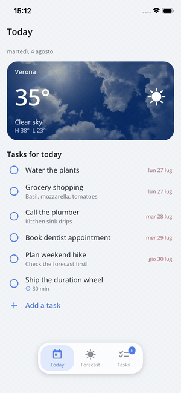

# Scaffold Transitions, Shared Elements & Modals

Every page transition in the Scaffold is Nalu-driven: declarative specs, seekable
animations, interactive gestures on both platforms — no Shell/Fragment animation quirks.

## Page transitions

A `ScaffoldPageTransition` declares how the **pushed** page enters (`Enter` motion: fractional
translation, scale, opacity), what the covered page does behind it (`Behind`), and the
duration. The pop plays the same spec in reverse — as does the iOS interactive edge swipe and
Android predictive back.

Built-in specs: `Default` (plain slide), `SlideFromRight` (iOS-style with behind parallax),
`SlideUpFade`, `ZoomFade`, `SlideFromBottom` (the modal default), `None`.

```xml
<!-- Scaffold-wide -->
<nalu:Scaffold nalu:Scaffold.PageTransition="{x:Static nalu:ScaffoldPageTransition.SlideFromRight}">

<!-- Or per page (the spec belongs to the PUSHED page) -->
<ContentPage nalu:Scaffold.PageTransition="{x:Static nalu:ScaffoldPageTransition.SlideUpFade}">
```

Custom specs are plain records:

```csharp
public static readonly ScaffoldPageTransition Reveal = new(
    Enter: new ScaffoldTransitionMotion(FractionY: 0.05, Opacity: 0),
    Behind: new ScaffoldTransitionMotion(Scale: 0.97, Opacity: 0.9),
    DurationSeconds: 0.3);
```

## Shared elements

Tag any view on both pages with the same `Scaffold.TransitionName` — matching pairs fly
between their geometries during push and pop, riding the standard slide:



*The card's photo, temperature, icon — and even the darkening scrim — fly between the two
layouts on push and pop.*

```xml
<!-- List page: the card photo -->
<Image nalu:Scaffold.TransitionName="weather-photo" Source="..." Aspect="AspectFill" />

<!-- Detail page: the full-bleed hero -->
<Image nalu:Scaffold.TransitionName="weather-photo" Source="..." Aspect="AspectFill" />
```

The engines (custom on both platforms) are built for **truthful flights**:

- Flights travel between the *visible* geometries — clipped/parallaxed content flies as the
  user sees it, not as its unclipped frame says.
- **Image pairs** morph their aspect crop; corner rounding follows (a rounded card un-rounds
  as it expands, including MAUI `Border` clipping).
- **Any other pair** (labels at different font sizes, scrims, boxes) cross-fades between
  rendered copies along the path, stacked in the same order as the live layouts.
- Pair your header **scrims** too (same `TransitionName` on both) so photo dimming stays
  constant mid-flight.
- Unmatched pairs and not-yet-laid-out targets gracefully fall back to the plain slide.

## Depth cues

Stacked motions (push, pop, and both interactive gestures) carry two automatic depth cues so
the moving page's boundary always reads, whatever the content: the page travelling **above**
casts a soft shadow (Android elevation / iOS layer shadow — both composited, no per-frame
cost), and the page revealed **beneath** sits under a subtle dim proportional to how covered
it still is, lifting as the top page departs. Side-by-side motions (root switches) get
neither — those pages are adjacent, not stacked.

## Interactive gestures

- **iOS edge-swipe pop**: left-edge pan scrubs the pop choreography — including shared-element
  flights — under the finger; release either completes (dispatching the pop through the
  engine) or cancels. Pages whose model implements `ILeavingGuard` block the gesture and route
  through the guard instead.
- **Android predictive back**: the system back gesture peeks the page below — padded for
  where it will land (its own nav/tab bar footprints, not the scrubbed page's) — and scrubs
  the pop under the finger, **including shared-element flights**: matching
  `Scaffold.TransitionName` pairs fly between the two pages driven by the gesture, complete
  with the settle on commit, and reverse home on cancel. Committing hands off to the engine
  pop (guards honored, `enableOnBackInvokedCallback` required, root pages defer to the native
  back-to-home preview).

## Modal pages

Modals are **navigation**, not overlays — same stack, same lifecycle, different presentation:

```xml
<ContentPage nalu:Scaffold.PageMode="Modal">              <!-- Default | Modal | DismissableModal -->
```

- `Modal` presents with `SlideFromBottom` (override with a page transition), hides the back
  chevron and drawer buttons, and blocks system back entirely (Android back/predictive back,
  iOS edge swipe) — dismissal is programmatic only.
- `DismissableModal` additionally shows the close (X) button and lets the Android system back
  dismiss; both route through the navigation engine (guards and lifecycle run).
- Push and pop modals with regular navigations (`Push<MyModalPageModel>()` / `Pop()`); the nav
  bar context exposes `IsModal` / `IsCloseButtonVisible` for custom bars.

## Notes

- Tab/root switches use `SlideStart`/`SlideEnd` presentation (direction of travel), not the
  page spec.
- Navigating while the soft keyboard is open dismisses it before the swap on both platforms.
- Transitions with and without shared elements move identically — the flights ride the same
  page motion.
