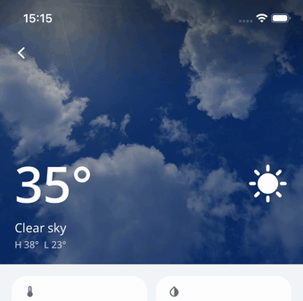

# Nalu.Maui.Scaffold

[](https://www.nuget.org/packages/Nalu.Maui.Scaffold/) [](https://www.nuget.org/packages/Nalu.Maui.Scaffold/)

A complete application shell for .NET MAUI — tab bar, nav bar, drawers, popups,
bottom sheets, page transitions and shared elements — replacing MAUI `Shell` as the host for
[Nalu navigation](navigation.md), on **iOS and Android**.

> `Nalu.Maui.Navigation` keeps working with MAUI Shell exactly as before — the Scaffold is an
> *additional* host, not a breaking change.

## Why a Scaffold?

MAUI Shell owns the chrome natively, and that ownership is the root of a long tail of problems:

- **Native nav/tab bars are style-limited** — iOS especially: no full control over heights,
  transitions, translucency, or content. Every "customize the tab bar" request eventually hits
  a platform wall.
- **Chrome behavior differs per platform** — safe areas, title views, animations and back
  handling all behave subtly differently between iOS and Android Shell.
- **Navigation events can bypass the pipeline** — e.g. tab switches performed by native chrome
  don't reliably route through cancelable navigation, breaking guards and lifecycle.

The Scaffold flips the model: **every piece of chrome is a MAUI view drawn by Nalu**, and every
navigation — tab tap, back gesture, flyout selection — routes through the Nalu navigation
engine (guards, lifecycle, intents included). What you style is what renders, identically, on
both platforms.



*One page of the sample app: full-bleed photo header, scroll-materializing nav bar, fading
title, parallax — and the status-bar icons flipping to match. All declarative.*

**What you get:**

| Feature | Docs |
|---------|------|
| Areas, roots and the tab bar (with overflow) | [Structure & Tab Bar](scaffold-structure.md) |
| Nav bar and the appearance system | [Nav Bar](scaffold-navbar.md) |
| Scroll tracker, materializing chrome, parallax | [Scroll-Driven Effects](scaffold-scroll.md) |
| Drawers on both sides | [Flyouts](scaffold-flyout.md) |
| Popups, bottom sheets, tab bar panels, MVVM overlays | [Popups & Sheets](scaffold-overlays.md) |
| Page transitions, shared elements, modal pages, predictive back | [Transitions](scaffold-transitions.md) |
| Status-bar icon styles that follow your UI | [System Bars](scaffold-systembars.md) |
| Using the Scaffold without page models | [View-Only Navigation](navigation-view-only.md) |
| Moving from `NaluShell` | [Migration Guide](scaffold-migration.md) |

## Quick Start

### 1. Installation

```bash
dotnet add package Nalu.Maui.Scaffold
```

### 2. Setup in MauiProgram.cs

The Scaffold *hosts* Nalu navigation — register both:

```csharp
builder
    .UseMauiApp<App>()
    .UseNaluNavigation<App>(nav => nav
        .AddPage<TodayPageModel, TodayPage>()
        .AddPage<SettingsPageModel, SettingsPage>())
    .UseNaluScaffold();
```

`UseNaluScaffold()` is **required** (it registers the scaffold handler). Page registration,
view models, intents and lifecycle are standard Nalu navigation — see the
[Navigation docs](navigation.md).

> **No MVVM? No problem.** Page models are optional: register plain pages with
> `AddPage<TodayPage>()`, navigate with `Push<DetailPage>()`, and implement lifecycle
> interfaces (`IEnteringAware`, `ILeavingGuard`, intents…) directly on the page — or bring
> your own MVVM abstraction as a thin facade over `INavigationService`. Guards, transitions,
> gestures and tab-stack preservation all work identically.
> See [View-Only Navigation](navigation-view-only.md).

### 3. Define your application structure

The Scaffold is a XAML element describing the whole app: areas → roots → pages.

```xml
<nalu:Scaffold xmlns="http://schemas.microsoft.com/dotnet/2021/maui"
               xmlns:x="http://schemas.microsoft.com/winfx/2009/xaml"
               xmlns:nalu="https://nalu-development.github.com/nalu/scaffold"
               xmlns:pages="clr-namespace:MyApp.Pages"
               x:Class="MyApp.AppScaffold">

    <nalu:ScaffoldTabBar>
        <nalu:ScaffoldRoot Title="Today" PageType="{x:Type pages:TodayPage}">
            <nalu:ScaffoldRoot.Icon>
                <FontImageSource FontFamily="Material" Glyph="&#xe8df;" Size="24" />
            </nalu:ScaffoldRoot.Icon>
        </nalu:ScaffoldRoot>
        <nalu:ScaffoldRoot Title="Settings" PageType="{x:Type pages:SettingsPage}" />
    </nalu:ScaffoldTabBar>

</nalu:Scaffold>
```

Each `ScaffoldRoot` owns an independent navigation stack; the tab bar renders with the default
Telegram-style pill (fully restylable, or replaceable wholesale).

### 4. Host it in the window

```csharp
public partial class App : Application
{
    private readonly IServiceProvider _serviceProvider;

    public App(IServiceProvider serviceProvider)
    {
        _serviceProvider = serviceProvider;
        InitializeComponent();
    }

    protected override Window CreateWindow(IActivationState? activationState)
        => new(_serviceProvider.GetRequiredService<AppScaffold>());
}
```

Register the scaffold subclass itself as a singleton (`builder.Services.AddSingleton<AppScaffold>()`).

### 5. Navigate as usual

Nothing changes on the navigation side — the same `INavigationService`, relative/absolute
navigations, guards and intents:

```csharp
await navigationService.GoToAsync(Navigation.Relative().Push<WeatherDetailPageModel>());
```

Tab taps, the Android back gesture/button, the iOS edge-swipe pop and flyout selections all
route through the same engine — `ILeavingGuard` and lifecycle events fire exactly as for
programmatic navigations.

That also means engine-level features light up unchanged — including
[navigation state restoration](navigation-restore.md): opt in with
`builder.UseNaluNavigationRestore(...)` and the app lands exactly where it was after
a restart (the Scaffold is the verified host).

## Sample app

The repository contains **Daily Helper** (`Samples/Nalu.Maui.DailyHelper`), a complete
Scaffold-based sample: three tabs, scroll-driven transparent nav bar over a photo header,
shared-element push/pop, popups, sheets and system-bar integration. It is the best starting
point to see everything working together.

## Platform support

- Scaffold **hosting** (the chrome, transitions, gestures): **iOS** 12.2+ and **Android**
  API 21+.
- The **package** is referencable from every platform (Windows/Mac Catalyst pick the neutral
  `net10.0` assembly): `UseNaluScaffold()` is callable everywhere and always registers
  `IOverlayService` and `IScaffoldFlyoutController`, so shared page models keep injecting
  them — every call is a graceful no-op (default results, no UI) while the app is not
  scaffold-hosted. Hosting an actual `Scaffold` on Windows/Catalyst throws
  `PlatformNotSupportedException`.
