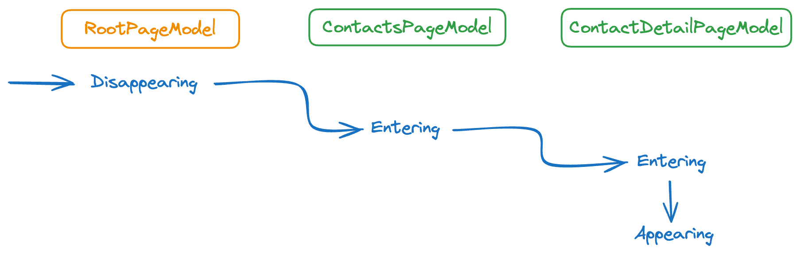
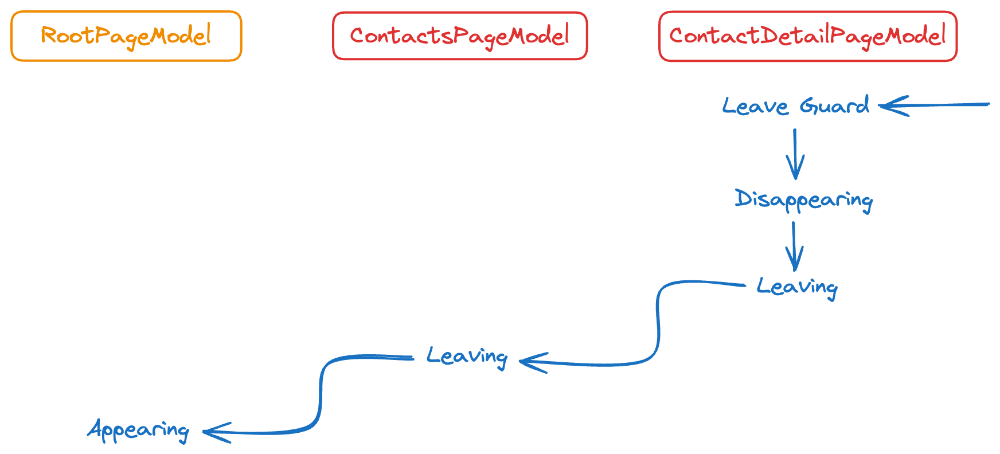

## Nalu.Maui

`Nalu.Maui` provides a set of classes to help you with everyday challenges encountered while working with .NET MAUI.

The very first citizen is the MVVM navigation service, which is a simple and powerful way to navigate between pages and pass parameters.
The navigation system is based on [`Shell`](https://learn.microsoft.com/dotnet/maui/fundamentals/shell/?view=net-maui-8.0) so you can leverage the simplicity of defining the flyout menu, tabs, and root pages.
At the same time `Nalu.Maui` provides a set of extension methods to simplify the navigation between pages.

The navigation API is designed to be simple and easy to use, and it features `Relative` and `Absolute` navigation.

### Typed Navigation API

```csharp
// Push the page registered with the DetailPageModel
await _navigationService.GoToAsync(Navigation.Relative().Push<DetailPageModel>());
// Navigate to the `SettingsPageModel` root page
await _navigationService.GoToAsync(Navigation.Absolute().Add<SettingsPageModel>());
```

You can also pass type-checked parameters to the page model you are navigating to.

```csharp
// Pop the page and pass a parameter to the previous page model
// which should implement `IAppearingAware<MyPopIntent>`
await _navigationService.GoToAsync(Navigation.Relative(new MyPopIntent()).Pop());
```

And you can easily unit test your navigation logic.

```csharp
var expectedNavigation = Navigation.Relative().Push<DetailPageModel>();
navigationSevice.Received().GoToAsync(Arg.Is<Navigation>(n => n.Matches(expectedNavigation)));
```

### Intuitive Asynchronous Navigation Lifecycle Events

On top of that it provides a set of interfaces to react to navigation lifecycle events and **it takes care of disposing all the resources when the page is popped**.
The navigation system awaits every navigation lifecycle event, so you can safely perform asynchronous operations with real `async ValueTask` methods instead of relying on `async void` ones.

```csharp
Navigation.Relative()
    .Push<ContactsPageModel>()
    .Push<ContactDetailPageModel>()
```



There's also a "navigation guard" feature that allows you to prevent the navigation to happen if a condition is not met.
You can leverage that to ask the user to confirm leaving the page.

```csharp
// Starting from: RootPageModel > ContactsPageModel > ContactDetailPageModel
Navigation.Absolute()
    .Add<RootPageModel>()
```



### Read more

Documentation on this website is coming soon with a lot of examples and best practices.

In the meantime, you can check the [Nalu.Maui GitHub repository's README](https://github.com/nalu-development/nalu) which contains all the information you need to get started.
