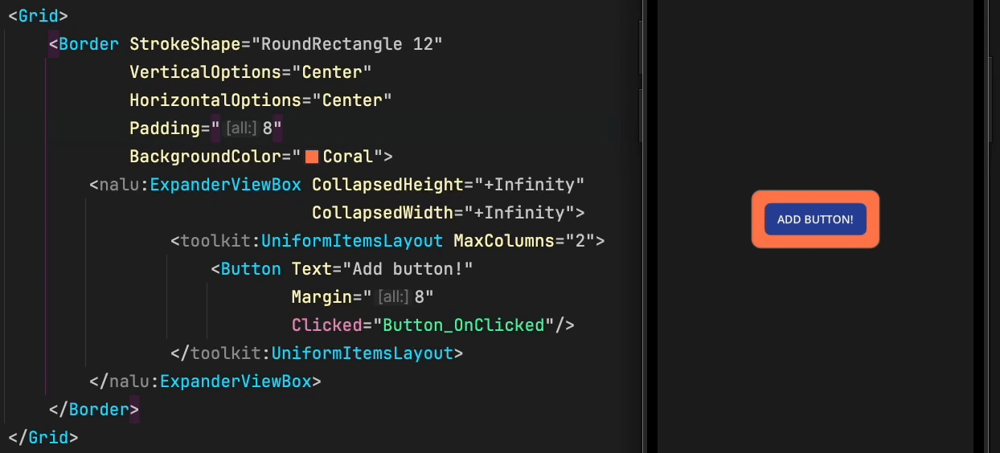
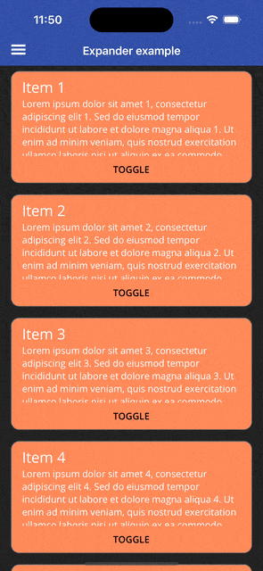

## Layouts [](https://www.nuget.org/packages/Nalu.Maui.Layouts/) [](https://www.nuget.org/packages/Nalu.Maui.Layouts/)

Cross-platform layouts for MAUI applications to simplify dealing with templates and `BindinginContext` in XAML.

Can be added to your project using `.UseNaluLayouts()` on your app builder.

### ViewBox

`ViewBox` is a lightweight replacement for `ContentView` class which is still based on the legacy Xamarin `Compatibility.Layout`.
You can simply use `ViewBox` as base class of your custom views instead of using `ContentView`.

This class also provides a `ContentBindingContext` property that allows you to bind the content to a property of the `ViewBox`'s binding context.
This helps to fulfill interface segregation principle.

On top of that, `ViewBox` offers the possibility to clip the content to the bounds of the view through `IsClippedToBounds` property.

```xml
<nalu:ViewBox ContentBindingContext="{Binding SelectedAnimal}"
              IsVisible="{Binding IsSelected}">
    <views:AnimalView x:DataType="models:Animal" />
</nalu:ViewBox>
```

### TemplateBox

Similarly to `ViewBox` this component holds a view based on `DataTemplate` or `DataTemplateSelector`.

```xml
<nalu:TemplateBox ContentTemplate="{StaticResource AnimalTemplate}" ContentBindingContext="{Binding CurrentAnimal}" />
```
```xml
<nalu:TemplateBox ContentTemplate="{StaticResource AnimalTemplateSelector}" ContentBindingContext="{Binding CurrentAnimal}" />
```

You can also project the content into the template (like you usually do with [ContentPresenter](https://learn.microsoft.com/en-us/dotnet/maui/fundamentals/controltemplate?view=net-maui-8.0#substitute-content-into-a-contentpresenter)).

The following example will display `Projected => I'm here!`.

```xml
<nalu:TemplateBox>

    <nalu:TemplateBox.ContentTemplate>
        <DataTemplate>
            <HorizontalStackLayout>
                <Label Text="Projected => " />
                <nalu:TemplateContentPresenter />
            </HorizontalStackLayout>
        </DataTemplate>
    </nalu:TemplateBox.ContentTemplate>

    <Label Text="I'm here!" />

</nalu:TemplateBox>
```

### ToggleTemplate

Usually to switch between views we use `IsVisible` property, but this is not always the best solution.
Using `IsVisible` still creates the view in the visual tree applying all the bindings (performance impact).
`ToggleTemplate` is a `TemplateBox` that generates a content view based on a boolean value and a corresponding `DataTemplate` (or even `DataTemplateSelector`).

```xml
<nalu:ToggleTemplate Value="{Binding HasPermission}"
                     WhenTrue="{StaticResource AdminFormTemplate}"
                     WhenFalse="{StaticResource PermissionRequestTemplate}" />
```

This can also be used with one single expensive template:
```xml
<nalu:ToggleTemplate Value="{Binding ShowExpensiveTemplate}"
                     WhenTrue="{StaticResource ExpensiveTemplate}" />
```

### ExpanderViewBox

`ExpanderViewBox` is a custom view that fully displays or **collapses** its content by **animating** the size transition.

You can use `+Infinity` collapse size to enable size-change animations.



This component is also useful for scenarios where you want to show or hide additional information dynamically or if you want to build an **accordion** control.

Here's an example of how we can use it to build a section that can be expanded or collapsed through a button only when the content exceeds the `CollapsedHeight`.

```csharp
private void ToggleExpended(object? sender, EventArgs e)
{
    TheExpander.IsExpanded = !TheExpander.IsExpanded;
}
```

```xml
<VerticalStackLayout>

    <!-- This button is only visible when the expander's content is bigger than the collapsed size. -->
    <Button Text="Toggle expanded"
            Clicked="ToggleExpended"
            IsVisible="{Binding Path=CanCollapse,
                                Source={x:Reference TheExpander},
                                x:DataType=nalu:ExpanderViewBox}"/>

    <nalu:ExpanderViewBox x:Name="TheExpander"
                          BackgroundColor="Coral"
                          CollapsedHeight="200">

        <VerticalStackLayout VerticalOptions="Start">
            <Label Text="List of my friends" />
            <!--
                The height of this stack layout depends on the number of friends,
                so the height will change at runtime and may or may not exceed the collapsed height. 
            -->
            <VerticalStackLayout BindableLayout.ItemsSource="{Binding Friends}"
                                 BindableLayout.ItemTemplate="{StaticResource FriendTemplate}" />
        </VerticalStackLayout>

    </nalu:ExpanderViewBox>

</VerticalStackLayout>
```

You can even use `ExpanderViewBox` as a `CollectionView`'s `ItemTemplate` to animate the size change of each item.



```csharp
private void ScrollToMe(object? sender, EventArgs e)
{
    TheCollectionView.ScrollTo((sender as BindableObject)?.BindingContext);
}
```

```xml
<CollectionView ItemsSource="{Binding Items}"
                x:Name="TheCollectionView">
    <CollectionView.ItemTemplate>
        <DataTemplate x:DataType="pageModels:MyItem">
            <nalu:ViewBox Padding="16,8">
                <Border StrokeShape="RoundRectangle 12"
                        BackgroundColor="Coral">
                    <VerticalStackLayout>
                        <nalu:ExpanderViewBox CollapsedHeight="126"
                                              IsExpanded="{Binding IsExpanded}">
                            <VerticalStackLayout Padding="16,8">
                                <Label Text="{Binding Name}" FontSize="Large"/>
                                <Label Text="{Binding Description}"/>
                            </VerticalStackLayout>
                        </nalu:ExpanderViewBox>
                        <Button Text="Toggle"
                                BackgroundColor="Coral"
                                TextColor="Black"
                                Clicked="ScrollToMe"
                                Command="{Binding ToggleCommand}"/>
                    </VerticalStackLayout>
                </Border>
            </nalu:ViewBox>
        </DataTemplate>
    </CollectionView.ItemTemplate>
</CollectionView>
```

### Magnet

`Magnet` is a powerful **constraint-based** layout that allows you to create complex layouts with ease by defining constraints.


The documentation is not yet available here, but you can [look at this presentation](https://docs.google.com/presentation/d/1VkKodflxRsIWdPN8ZgwiQKUBybEszTV3gXBW4cIiEqs/edit?usp=sharing).

Keep in mind this layout is in **alpha/preview** state so its API may be subject to change.

Here's a performance comparison between `GridLayout` and `MagnetLayout` considering two scenarios:
1. **Dynamic measure**: All the views keep chaining their size on each measure pass (rare case)
2. **Constant measure**: The views always return the same size (very common)

| Method                          | Mean     | Error     | StdDev    | Gen0     | Allocated |
|-------------------------------- |---------:|----------:|----------:|---------:|----------:|
| GridLayoutPerf                  | 2.264 ms | 0.0216 ms | 0.0192 ms | 222.6563 |   1.78 MB |
| MagnetLayoutPerf                | 6.694 ms | 0.0436 ms | 0.0408 ms | 273.4375 |   2.21 MB |
| GridLayoutConstantMeasurePerf   | 1.395 ms | 0.0136 ms | 0.0114 ms | 166.0156 |   1.33 MB |
| MagnetLayoutConstantMeasurePerf | 2.724 ms | 0.0387 ms | 0.0362 ms | 218.7500 |   1.75 MB |
  
As we can see `Magnet` is about 2 times slower than `Grid` but it provides a lot of flexibility and power.
So it's up to you to decide whether to use `Magnet` or the standard MAUI layouts.

On a common page with a few views, the performance impact is negligible while the flexibility gain is huge in comparison.

Inside a `CollectionView` template is probably better to use MAUI layouts, but that still needs to be verified with real data
considering that you may be forced to use nested layouts to achieve the same result and that also comes with a non-negligible performance cost.

**Important:**
- in a `CollectionView` template, make sure your `Stage` property references a `MagnetStage` defined outside the template (aka `Resources`)
- at the moment it is not supported to change the `MagnetStage` content at runtime

